# Youtube 查看内容创建者的预测

> 原文：<https://medium.com/analytics-vidhya/youtube-views-prediction-for-content-creators-9ebb2ebb5e54?source=collection_archive---------12----------------------->

*一个自我启动的项目，使用数据科学技术来预测你的 Youtube 视频的浏览量*

在 Youtube 上做一名内容创作者的确很有挑战性，如果你是一名刚刚加入该平台的 Youtube 用户(就像我一样)，你获得的浏览量可能会比你想象的少得多。这个项目将帮助我的 Youtubers 伙伴，他们想知道他们的视频会有多少浏览量。在我们开始之前，如果你能检查我的[频道](https://www.youtube.com/channel/UCXR1vt6mVKJPhvYTM4jzqyA?view_as=subscriber)并且如果你喜欢视频的话可以订阅，那就太好了，因为它有助于算法。

首先，我面临着收集数据的挑战。我可以用网络搜集器收集数据——如果你想知道如何搜集，请点击这里查看我的文章或者使用由[谷歌](https://research.google.com/youtube8m/)提供的 Youtube 8M 数据集。但是为了培养新技能，我创建了一个大约有 10k 条记录的合成数据集。

**什么是合成数据集？**

顾名思义，合成数据集是以编程方式生成的数据的存储库。所以，它没有被任何现实生活中的调查或实验所收集。它的主要目的是足够灵活和丰富，以帮助 ML 从业者用各种分类、回归和聚类算法进行有趣的实验。期望的特性是，

*   它可以是数字、二进制或分类(序数或非序数)，
*   特征的数量和数据集的长度应该是任意的
*   最好是随机的**并且用户应该能够选择各种各样的**统计分布**来作为该数据的基础，即基本的**随机过程可以被精确地控制和调整**，**
*   **如果用于分类算法，那么**类别分离度**应该是可控的，以使学习问题容易或困难，**
*   ****随机噪音**可以可控方式插话**
*   **对于回归问题，复杂的非线性生成过程**可用于获取数据****

**Python 中有几个库，我们可以通过它们创建合成数据集，即 Faker 和 Mimesis。两者都能确保完成任务，但是在速度和内存执行以及对数据模拟的完全控制方面，它们都轻而易举地胜出。数据集是使用 Mimesis 包创建的。访问 [Faker](https://faker.readthedocs.io/en/master/) 和[哑剧](https://github.com/lk-geimfari/mimesis)了解更多。**

**让我们从导入所有必要的库和实例化各种类来生成合成数据开始..**

**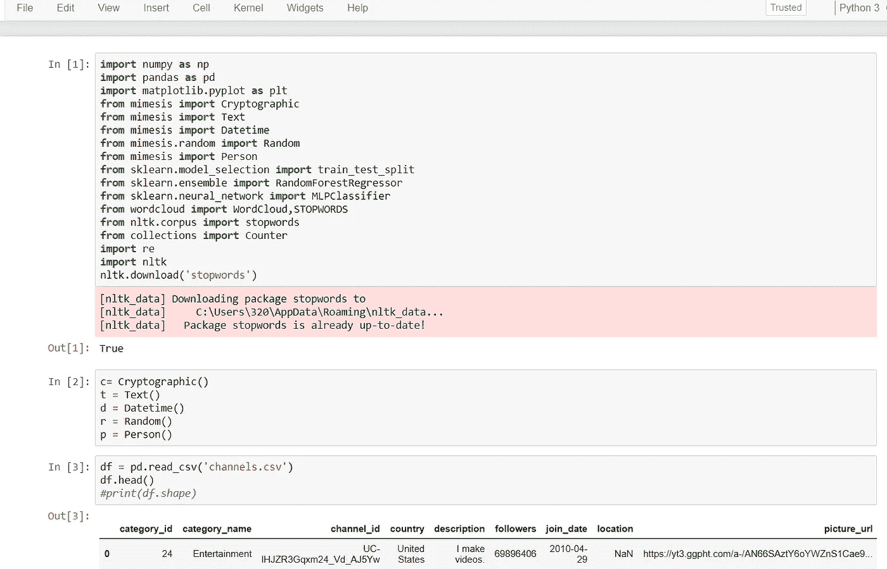**

**您可能已经注意到我使用了一个 CSV 文件，您可能想知道他为什么要创建合成数据，因为他已经有数据了。为了回答这个问题，该项目的核心思想是让较小的 youtube 创建者了解浏览量预测。接下来，我只选择了带有“音乐”和“娱乐”的类别名称，并将两者连接起来以获得一个新的数据框架。与此同时，创建了一个新的数据帧，用于存储视频少于 8 个的频道的视频(因为我想创建一个适合小型 youtubers 的数据集)。**

**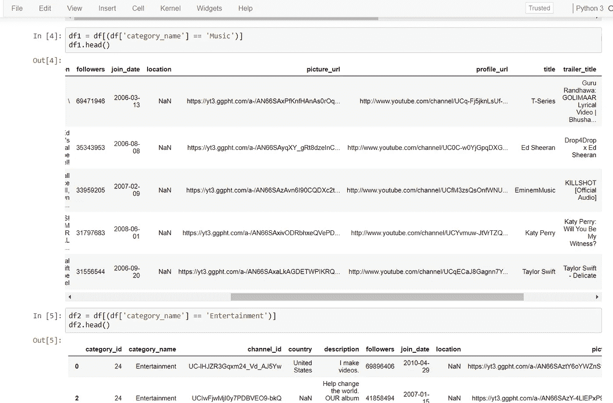****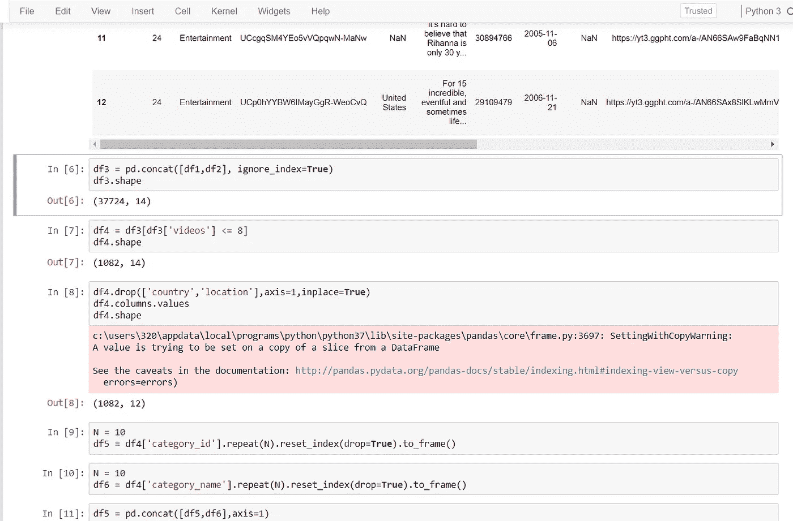**

**这些数据中最没意思的是视频的国家和地点，所以我把它们一起删除了。**

**如您所见，category_id 和 category_name 列的数据被复制了 10k 次，因为我不想要除“音乐”和“娱乐”之外的类别。**

**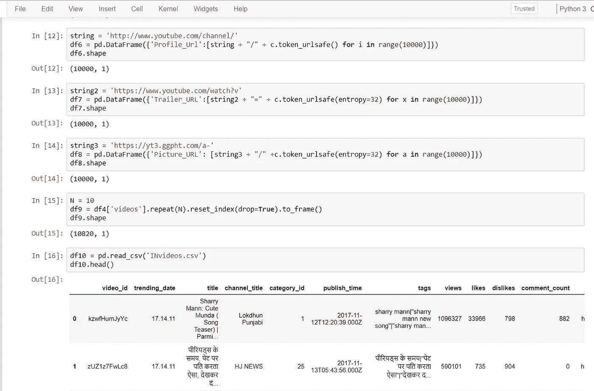**

**Memesis 通过创建“个人资料 _ 网址”、“预告片 _ 网址”和“图片 _ 网址”来发挥作用。由于数据是为小于 8 的视频拍摄的，这些数据是不够的，因此需要再次创建它们。另一个 CSV 文件用于删除“tags”和“video_id”部分。这些字段在早期的 CSV 文件中丢失，因此另一个 CSV 文件和“标签”被取走，它需要与视频相关，在创建该字段的合成数据时，我意识到准确性受到了影响，因此我取走了一些真实的数据。**

**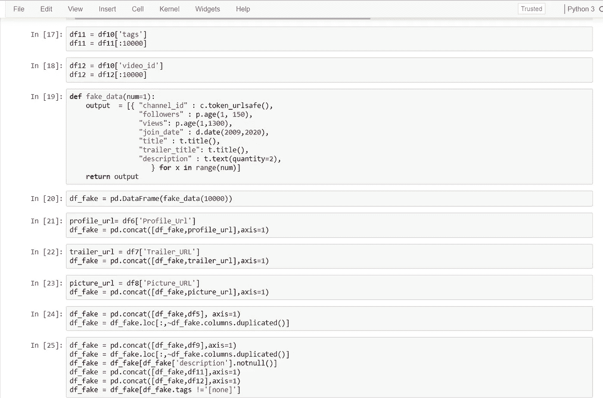**

**:1000 表示只访问 10k 行**

**为了完成创建合成数据集的过程，创建了一个覆盖数据的剩余字段的函数。作为一个小 Youtuber 可能没有超过 2k 的订阅者(追随者),我想把阈值设置为 150。剩下的工作是非常基本的。**

**现在，合成数据集已成功完成，让我们开始创建训练、验证和测试数据。数据集以 80%-10%-10%的比例分为 3 个部分，其中 80%的数据用于训练，其余数据用于验证和测试。**

**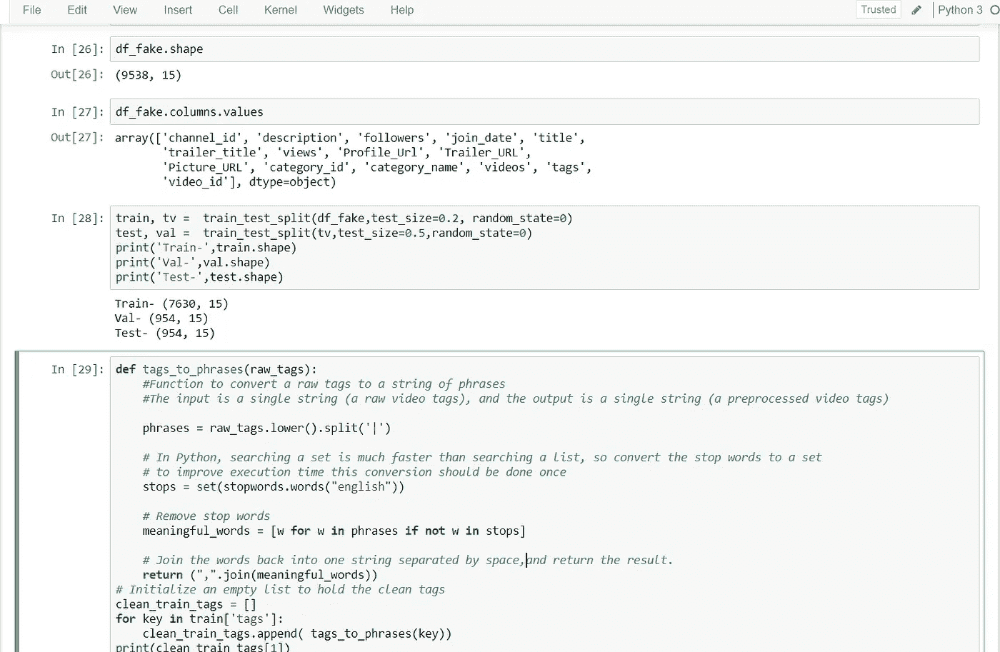**

****数据可视化:** *可视化标签***

**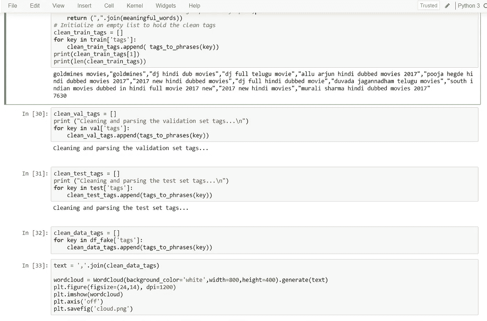**

**为了可视化任何数据，你需要进行数据清理。这是在所有三组(训练、验证、测试)上完成的，这使我们..**

**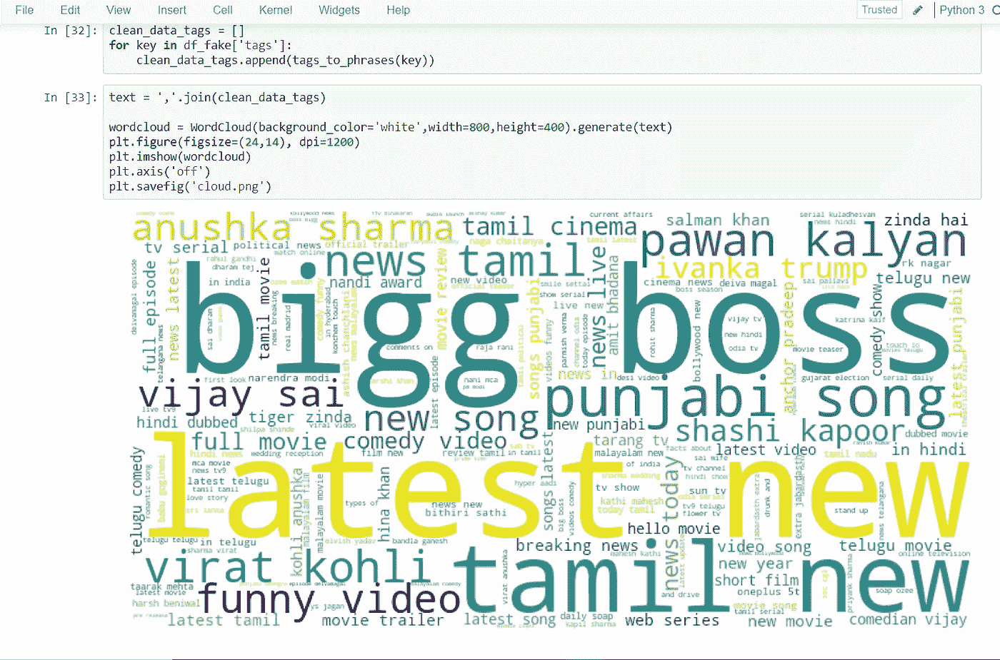**

**很美，不是吗？**

****数据建模:** *将随机森林回归器与 MLP 分类器相结合并平均***

**在开始使用文本数据进行预测建模之前，需要对其进行特殊准备。必须对文本进行解析以删除单词，这称为标记化。然后，需要将单词编码为整数或浮点值以供使用，作为机器学习算法的输入，称为特征提取(或矢量化)。scikit-learn 库提供了易于使用的工具来执行文本数据的标记化和特征提取。**

**我们使用 Countvectorizer 来创建一个单词袋模型。countvectorizer 自带选项来自动进行预处理标记化和停用词移除。Numpy 数组很容易处理，因此结果被转换成一个数组。FitTransform 在这里做两件事——首先，它适合模型并学习词汇，其次，它将我们的训练数据转换为特征向量。**

**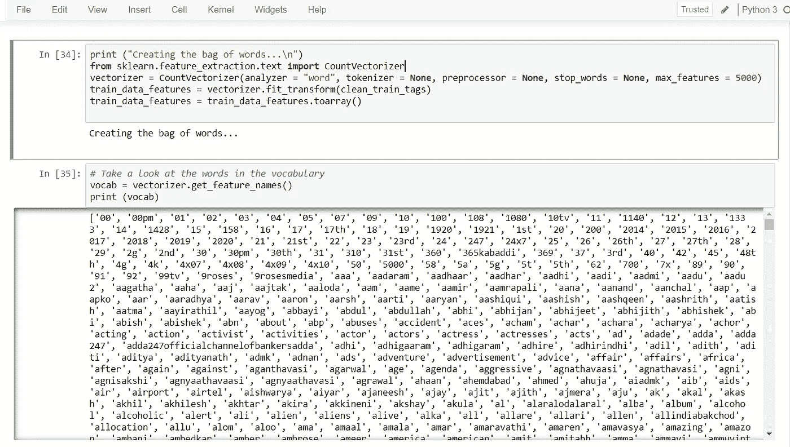**

**我使用随机森林和神经网络来预测视图。**

**一个**随机森林**是一个灵活的，易于使用的机器学习算法，它在大多数情况下产生很好的结果，而花在超参数调整上的时间最少。由于其简单性和可用于分类和回归任务的事实，它已经获得了广泛的应用。**

****多层感知器分类器**，顾名思义，它连接到一个神经网络。MLP 分类器依赖于底层神经网络来执行分类任务。该模型使用随机梯度下降优化对数损失函数。**

**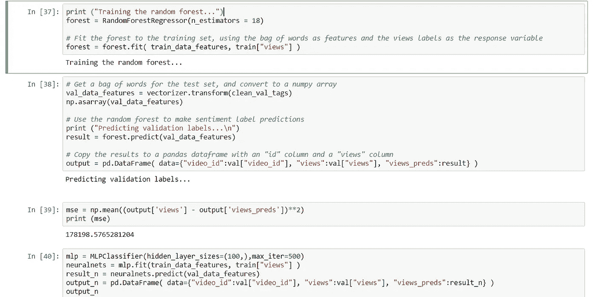**

**这是预测输出。**

**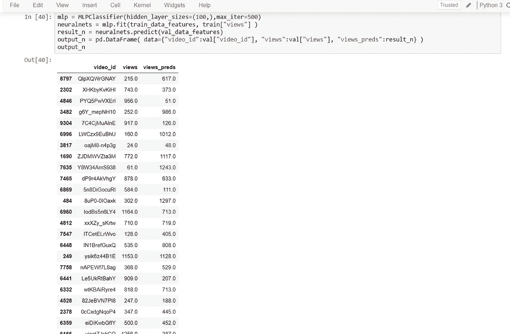**

**均方误差告诉你回归线离一组点有多近。它通过从点到回归线的距离(这些距离就是“误差”)并平方它们来实现。平方是必要的，以消除任何负号。它也给予较大的差异更多的权重。它被称为均方误差，因为你在寻找一组误差的平均值。我们得到的均方差是-**

**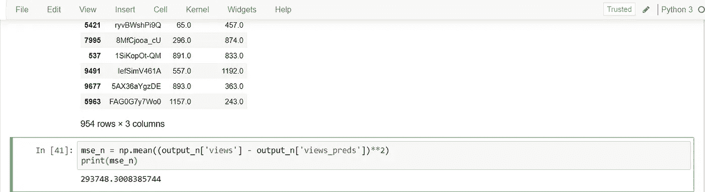**

**那太高了！**

**我们使用了另一种叫做平均的集合方法。建模平均集成同等地组合来自每个模型的预测，并且通常产生比给定的单个模型更好的平均性能。加权平均集成是一种允许多个模型根据它们的信任度或估计性能成比例地对预测做出贡献的方法。**

**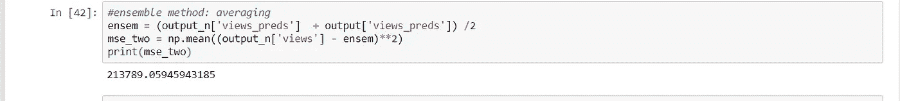**

****最后一步:** *利用测试数据评估模型的性能***

**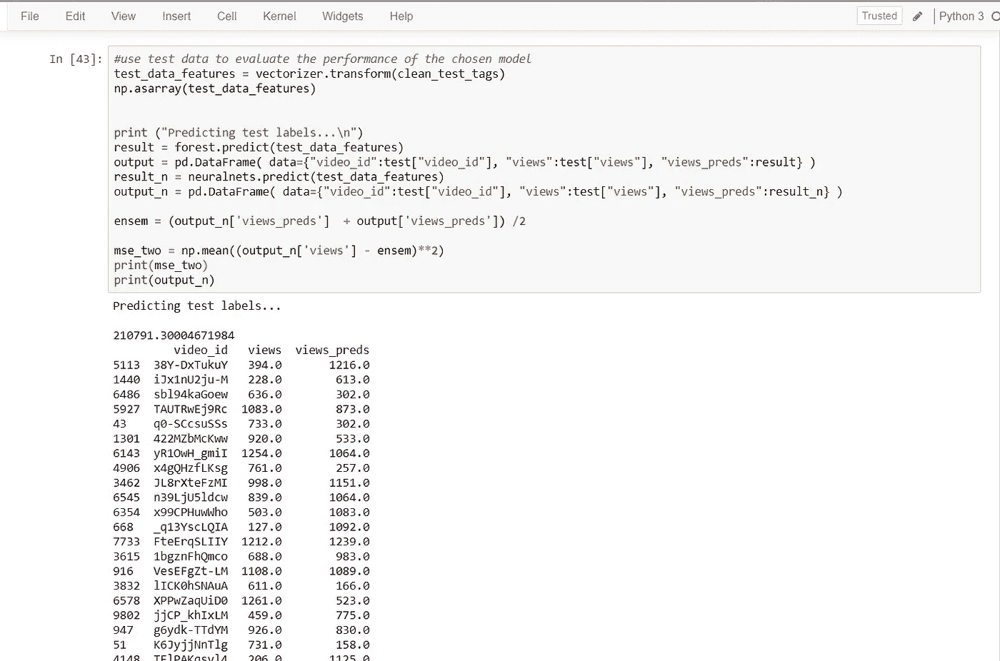**

**耶！我们得到了预言！！现在我们有了数据、模型和预测，下一步就是在网上实现它，这样它就可以被我的 Youtubers 伙伴们使用了。我想到的一个方法是节省模型重量或使用泡菜。你对此有什么想法？请在下面留下评论。你可以在我的 Github 上找到我的 Jupyter 笔记本。感谢阅读！**