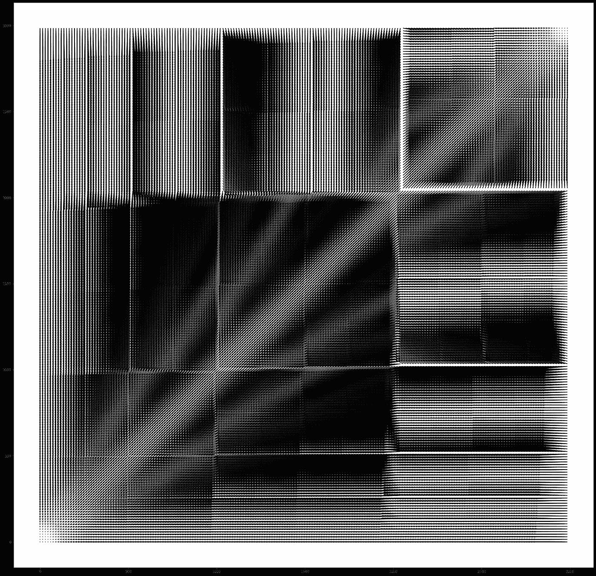
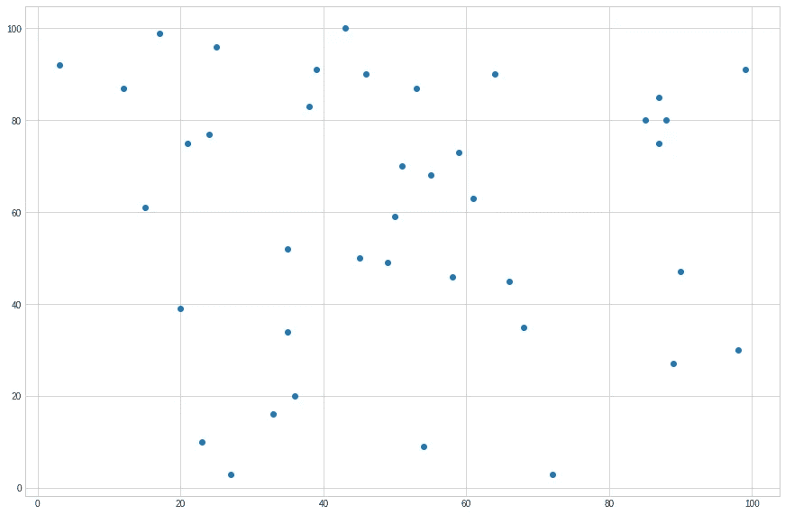
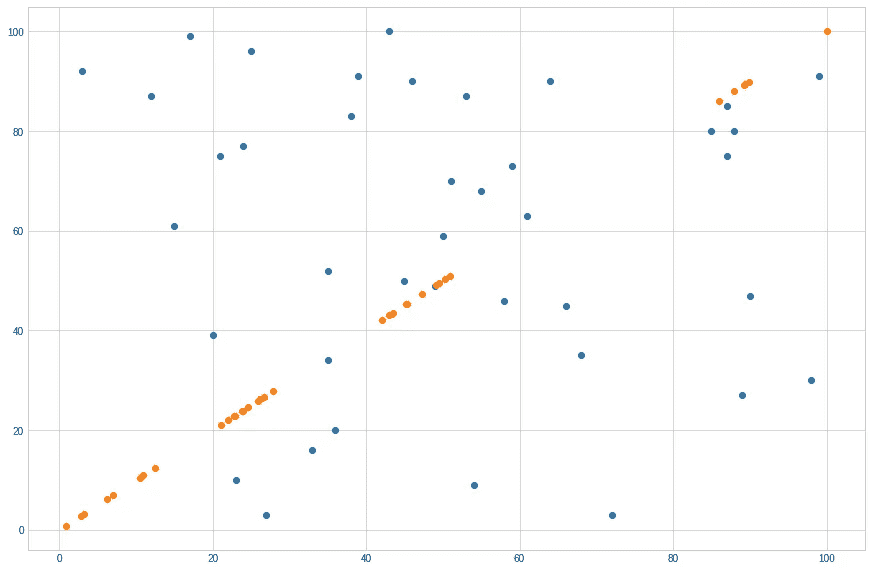
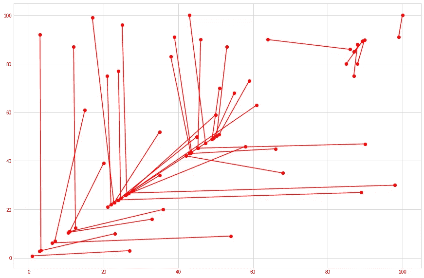
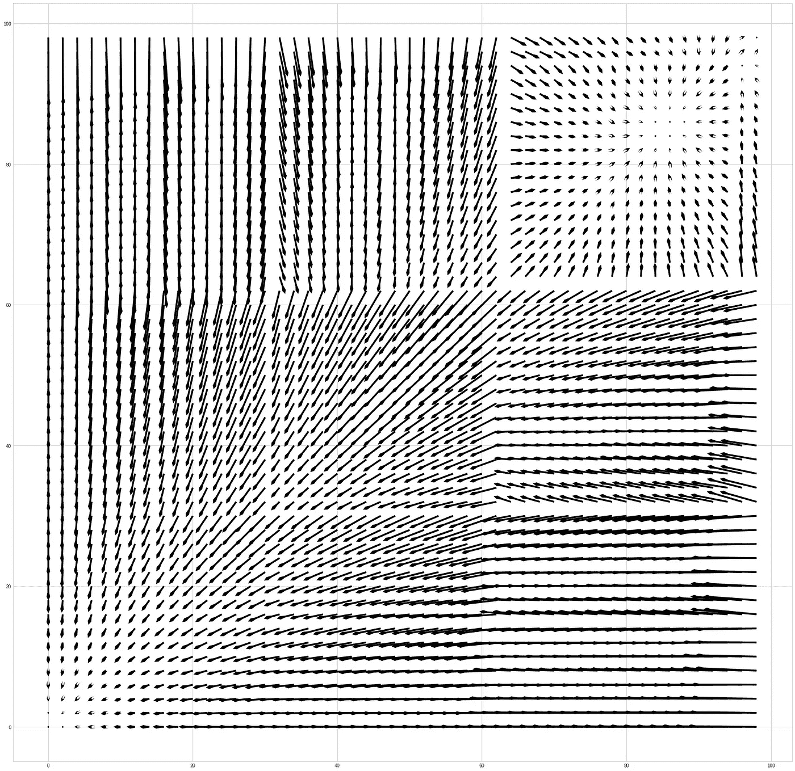
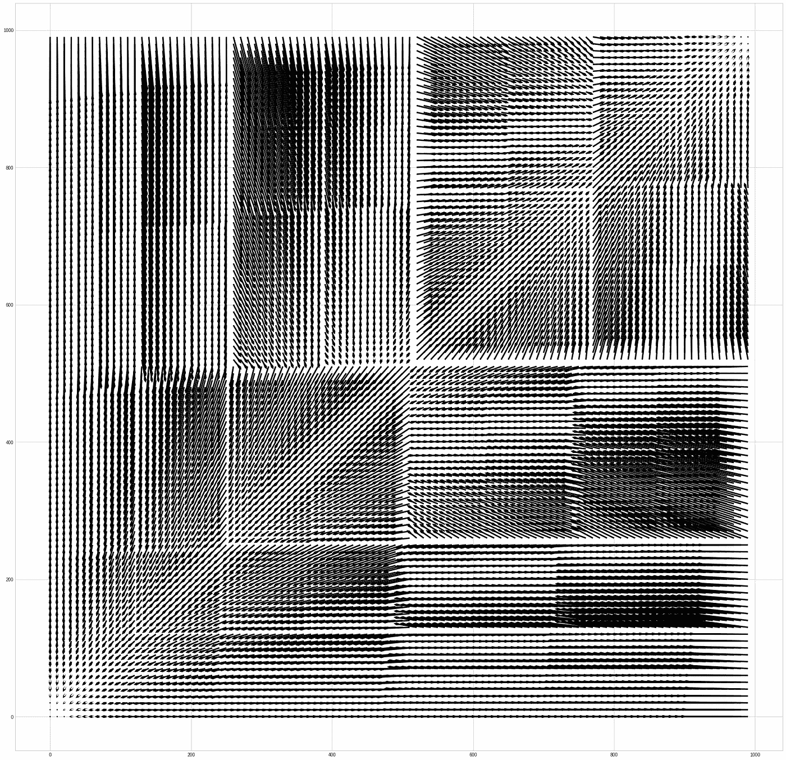
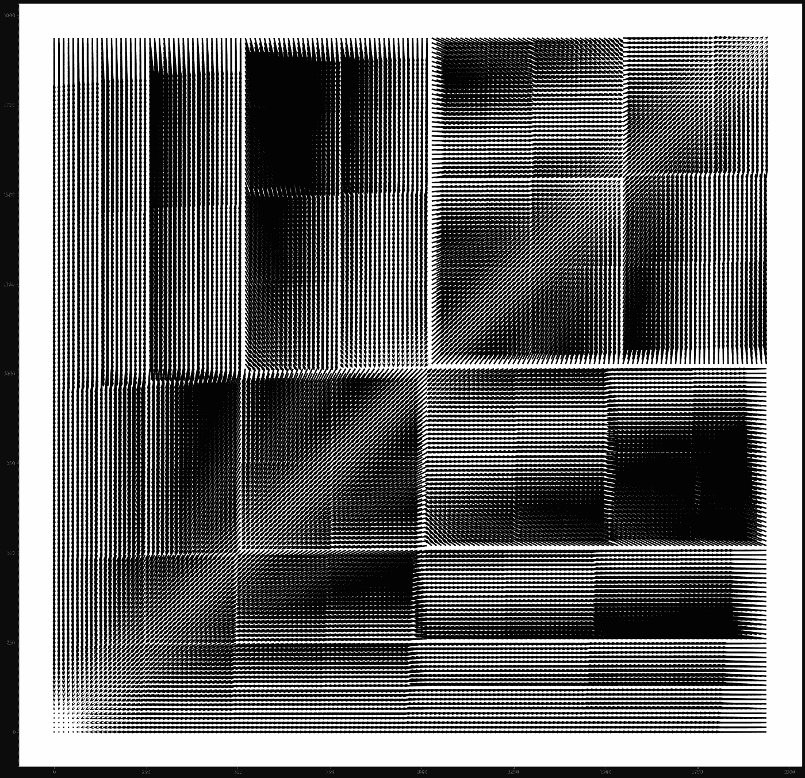
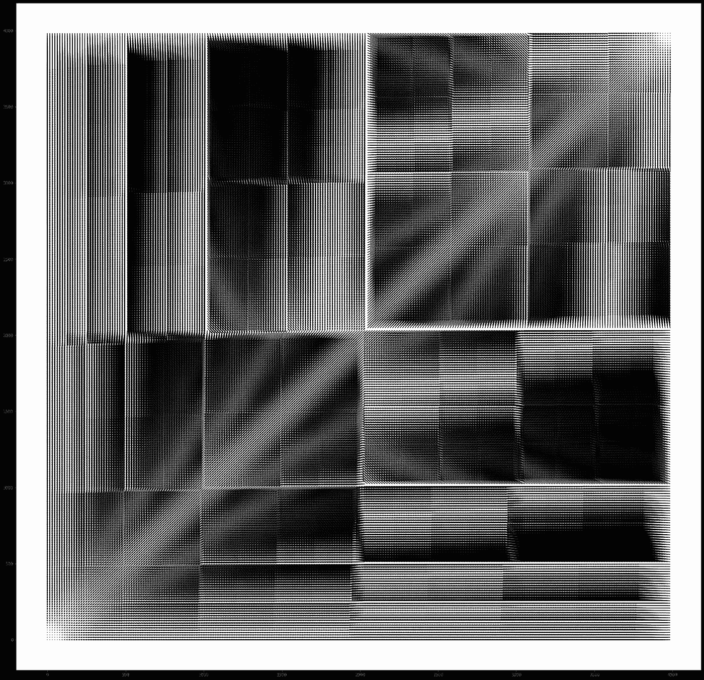

# z 索引向量

> 原文：<https://medium.com/analytics-vidhya/z-index-vectors-5a0814e59d01?source=collection_archive---------14----------------------->

一个新的实验工业电子展的专辑封面

图表很漂亮。我有幸运行了正确的 python 命令来构建上面的矢量场图。让我们浏览一下它描述的内容。

本文的灵感来源于这篇文章([https://AWS . Amazon . com/blogs/database/z-order-indexing-for-multiplient-queries-in-Amazon-dynamo db-part-1/](https://aws.amazon.com/blogs/database/z-order-indexing-for-multifaceted-queries-in-amazon-dynamodb-part-1/))。推荐去看看！

# z 索引排序

我的理解是，z 索引排序是一种用于提高数据库查询效率的技术。它允许为每个可以查询的数据库条目创建一个特殊的“z-index”值，而不是查询条目本身中的数据。

但这不是我们要谈的。

我想探索 z-index 使用的一个简单的数学技巧。它也恰好是 z 索引排序技术工作的基础。

# 这是什么

当您从一组值中创建 z 索引值时，基本上是将多个维度压缩为一个维度。这就像把一组点投影到一条线上。 *n 个*数字进入功能， *1 个*数值出来。

# 它是如何工作的

让我们来研究一组两个数字。

(12, 65)

要获得该点的 z 索引值，我们需要将这些数字转换为二进制。

(1100, 1000001)

然后我们以交替的方式组合这些二进制数。我将 12 (1100)显示为斜体，65 (1000001)显示为粗体。

*1***1***1***0***0***0***0***0***0*001

我们首先在两个数字之间交替，然后我们只需将剩余的值相加。这就产生了一个新的二进制数！让我们把它转换回十进制。

3585

^^，它是(12，65)的 z 索引值。

**例题**

让我们考虑下面的例子。

*l* 是 0 到 100 之间的一组随机点(例如，(2，4)，(67，54)，…)。

标绘，看起来是这样的。

集合 l

现在，让我们导出每个点的 z 索引值，并用橙色绘制。

**注意:**我开始将 z 索引值缩小到范围 0 -100。我通过以下方式实现了这一点

*比例= 100 /最大 z 轴指数*

*z-index = z-index(x，y) * scale*

该过程有效地将 z 指数值归一化为 0–100。

用 z 索引设置 l

这有点难以想象，让我们在每个点和它对应的 z 索引之间画一条线。

这个稍微好一点，我们可以开始看这些点是如何映射到 z-index 值的。

我注意到这个映射系统似乎有一个有趣的模式，我想看看更大的模式。向量是描述此类映射函数的好方法，因此我为 z 索引值构建了一个向量字段。

矢量场 100 x 100

这显示了 0-100 之间的点，以及描述其 z 索引值的向量。它本质上向我们显示了 z 索引值的方向和距离。

立刻，这是惊人的。广场似乎突然冒出来，将某些集群聚集在一起。

让我们看一个更大的范围，0-1000。

向量场 1000 x 1000

这种模式在这个尺度上更加明显。

我决定将这些向量场放大 1000 倍。

向量场 2000 x 2000

向量场 3000 x 3000

向量场 4000 x 4000

干净利落。

可能没啥用，但很美。