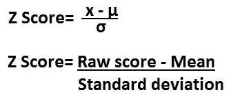
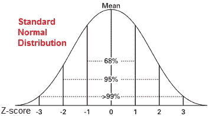
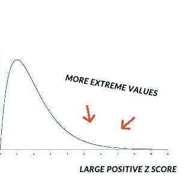
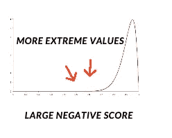
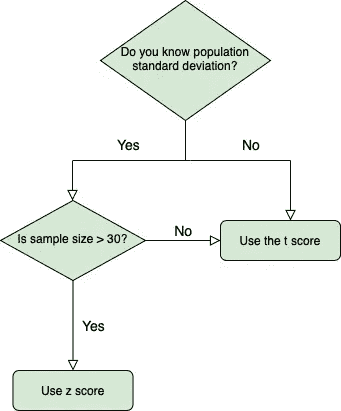

# z 分数:定义和解释

> 原文：<https://medium.com/analytics-vidhya/z-score-definition-interpretation-783cd6b00308?source=collection_archive---------12----------------------->

有时，研究人员会问一个问题，因为某个特定的观察结果是常见的或例外的。它可以被回答为从平均值中去除的标准偏差的数量。这叫 Z 评分。z 分数给出了关于观察有多极端的信息。

通过将正态分布的值转换为 z 得分来标准化这些值非常有用，因为:

> *(a)它允许计算分数出现在标准正态分布内的概率；*
> 
> *(b)它使我们能够比较来自不同样本的两个分数(可能具有不同的均值和标准差)。*

**Z 分数计算**

计算 Z 得分的公式为 z = (x-μ)/σ，其中 x 是原始得分，μ是总体均值，σ是总体标准差。

图片来源- [Z 评分 Calculatorlearningaboutelectronics.com](https://www.google.com/url?sa=i&url=http%3A%2F%2Fwww.learningaboutelectronics.com%2FArticles%2FZ-score-calculator.php&psig=AOvVaw1mPMvGZQsE9MMLi3kQ33iB&ust=1592876954692000&source=images&cd=vfe&ved=2ahUKEwirm9uZp5TqAhUX_xoKHWcIBzYQr4kDegUIARDfAQ)

怎么才能决定某个 Z 分是高还是低。这取决于上下文和分布。

1.  如果是正态分布

在这种情况下，我们可以说 Z 得分> 3 或 Z 得分

2\. If it is skewed to right.

Large positive Z scores are more common in right skewed graph.

3\. If it is skewed to left.

Large negative Z scores are more common as more extreme values are on left side of distribution.

For any distribution, regardless shape it is said that 75% of data must lie between -2 and + 2 Z score and 89% of data between -3 and 3 Z score values.

**Z 得分 vs t 得分**

在统计学中，很少有话题会让初学者感到困惑，比如什么时候应该使用 Z 分数，什么时候应该使用 t 分数。它们都用于假设检验。

**差异**

*   z 分数优选用于从群体原始数据或多于 30 个样本数据标准化为标准分数，而 t 分数是从少于 30 个数据的样本数据标准化为标准分数。
*   例如，Z 分数广泛用于股票市场数据和检查公司破产的可能性，而 t 分数广泛用于检查骨密度和骨折风险评估

该流程图解释了 Z 分数对 t 分数选择

参考资料:

1.  [https://www.coursera.org/lecture/basic-statistics](https://www.coursera.org/lecture/basic-statistics/1-08-example-W9o9U)
2.  [https://www.educba.com/z-score-vs-t-score/](https://www.educba.com/z-score-vs-t-score/)