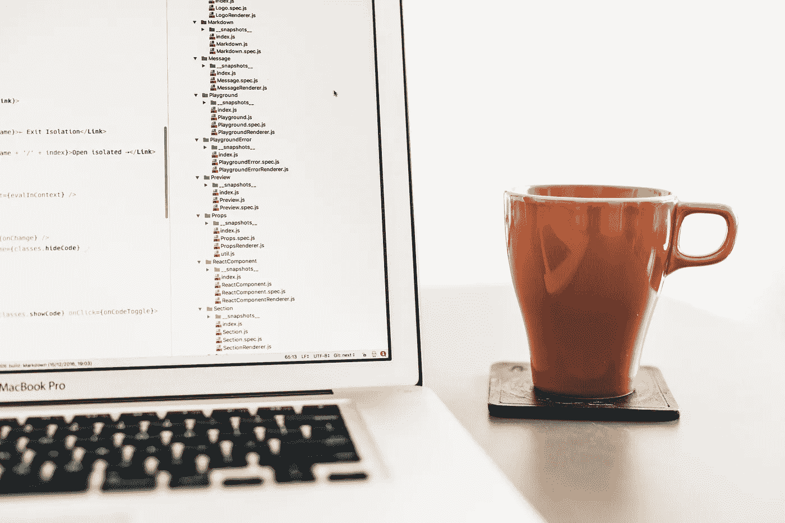

# Python 中的 z 分数和标准差

> 原文：<https://medium.com/analytics-vidhya/z-scores-and-standard-deviation-in-python-ae71803b332b?source=collection_archive---------6----------------------->

Artem Sapegin 在 [Unsplash](https://unsplash.com/s/photos/programming-python?utm_source=unsplash&utm_medium=referral&utm_content=creditCopyText) 上拍摄的照片

在 python 中查找 z 值和标准差的简要演练。

标准差和 z 值是用于帮助检查和解释数据的值。以这种方式检查数据可以为我们的数据集提供一个参考框架，从而更好地理解整体值。这些知识也可以帮助我们确定顺序问题的答案，比如下面这个问题。