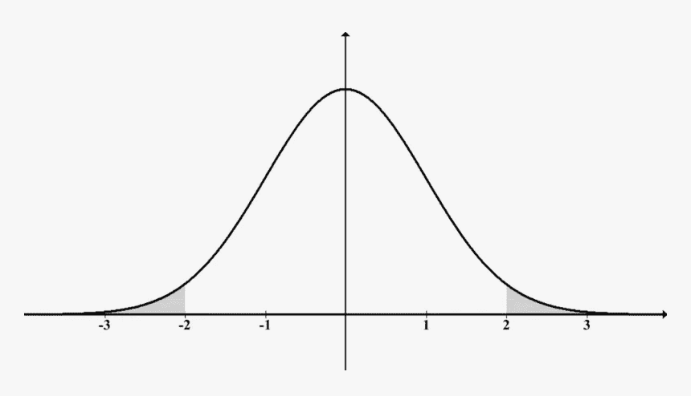
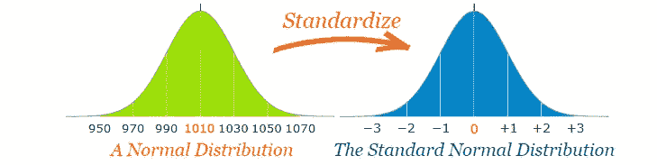
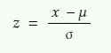
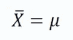
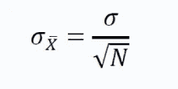
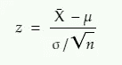
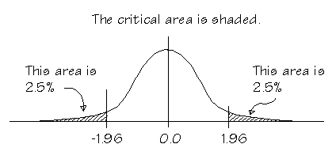

# z 检验——去神秘化

> 原文：<https://medium.com/analytics-vidhya/z-test-demystified-f745c57c324c?source=collection_archive---------13----------------------->

本·科尔德在 [Unsplash](https://unsplash.com?utm_source=medium&utm_medium=referral) 上的照片

当我们听到统计测试时，我们都会变得紧张，从许多测试中，一个非常著名的测试是 Z 测试。你可能知道什么时候使用它，但是从来没有想过为什么它有某种类型的公式。

> 我向你保证，在这篇文章结束的时候，你会觉得你拥有了这个测试，你会对你所掌握的关于这个测试的知识感到惊讶。

让我们开始吧。

这个测试假设你有一些关于中心极限定理的知识。万一没有，看看我[以前的](/analytics-vidhya/why-central-limit-theorem-3d19e6fd7fce)帖子。

在开始 Z 测试之前，我们先来看一些概念，这有助于我们更好地理解这篇文章。

## 正态分布:

正态分布

也称为高斯分布，是一种关于其平均值对称的概率分布。它表示大多数值都在平均值附近，当我们从任一方向远离平均值时，概率会降低。它也被称为钟形曲线。均值、中值和众数重合。

# 标准正态分布:

来源:m [运动乐趣](https://www.mathsisfun.com/data/images/standardizing.svg)

它是均值= 0、标准差= 1 的正态分布的特例。

为了将正态分布转换为标准正态分布，我们使用 Z 得分，也称为标准得分。

z 分数的公式

**x** =我们想要标准化的值

**=**x 的分布均值****

******σ**= x 分布的标准偏差****

# ****经验法则:****

********

****来源: [SAS](https://blogs.sas.com/content/iml/files/2019/07/rule6895.png)****

****它指出，大约 68%、95%和 99.7%的数据分别位于正态分布的 1、2 和 3 个标准偏差内。****

# ****中心极限定理；****

****中心极限定理(CLT)指出，不管总体分布如何，当样本大小大于 30 时，样本均值的**采样分布的均值等于总体均值。******

****让我们试着理解一下上面强调的术语的含义， ***抽样分布*** 表示分布由样本组成，后面部分即 ***样本表示*** 暗示分布是统计量的“样本的均值”。我们知道，在中心极限定理中，我们创建大小大于 30 的样本数，计算样本的平均值，然后绘制它们。****

****它还指出，抽样均值的抽样分布将遵循正态分布****

****从数学上来说，它表示****

****设 **μ** 为总体均值 **σ** 为总体标准差。如果我们从总体中抽取多个大小为 **N** 的样本，那么根据 CLT，样本均值的抽样分布均值为****

********

****样本平均值=总体平均值****

****样本平均值的抽样分布的标准偏差如下所示****

********

****上述术语也称为标准误差。所以对于任何分布我们都有标准差，在 CLT 我们有样本均值的分布，样本均值的标准差被称为均值的标准差(只是一个花哨的术语)。****

****类似地，如果我们绘制样本方差的分布，那么分布的标准偏差将被称为方差的标准误差。****

# ****高潮时刻到了****

****现在我们已经完成了先决条件，让我们看看上述主题是如何与 Z 测试相关的，我们将尝试连接这些点。****

****我们都知道，Z 检验是用来检验样本分布是否来自均值为 **μ的总体。**为了做到这一点，我们检查样本均值是靠近还是远离总体均值，如果样本均值远离总体均值，我们说它来自不同的总体，但如果它靠近，那么我们说它来自相同的总体。****

****为此，我们使用一个公式并检查 z 统计量是大于还是小于 1.96(考虑双尾检验，α= 5%)****

********

****z 统计量****

****z = z 统计量****

****X̄ =样本平均值****

****μ =总体平均值****

****σ =总体标准偏差****

****n =样本量****

****让我们试着理解为什么我们会有这个公式。****

> ****因此，我们有一个总体，其均值为 **μ** ，样本均值为 **X̄** 。使用 CLT，我们可以说我们有许多样本，我们绘制样本均值分布图。根据 CLT 的说法，样本均值分布的均值将等于总体均值 **μ** ，标准差将为 **σ/√n** ，其中 **σ** 为总体标准差， **n** 为样本量。****

****在 Z 检验中，我们主要是想检查样本均值与总体均值有多远，我们总是会遇到不同的样本均值，对于不同的样本均值，我们会进行相同的计算来检查样本均值与总体均值有多远。****

****为了达到最佳效果，我们将分布标准化。但是我们只能标准化正态分布，我们不能确定我们的分布是否正态。那么，如何实现这一目标呢？****

****请记住，上面我们已经说过，我们将假设我们有多个样本均值，我们的样本 mean(X̄来自样本均值的分布。CLT 说样本均值的分布将遵循正态分布。****

****因此，我们的统计数据(样本 mean(X̄)来自正态分布，因此我们可以使用 z 得分公式对样本 mean(X̄进行标准化。****

********

****z 得分公式****

****因此，在上面的公式中，我们想要标准化来自具有平均值 **μ** 和标准差 **σ的分布的 **x** 。******

**但是在我们的例子中，我们想要标准化样本均值，即 X̄，它来自具有均值 **μ** (这是总体均值=样本均值的均值)和由 **σ/√n.** 给出的标准偏差的分布，因此在 z 得分公式中代入这些值，我们得到**

****

**z 统计量**

**通常在假设检验中，我们认为α= 5%，所以在双尾 Z 检验中，我们看到临界值为 1.96 和-1.96。1.96 从何而来？**

****

**来源: [sfu.ca](https://www.sfu.ca/personal/archives/richards/Zen/Media/Ch17-9.gif)**

**所以上图是一个标准的正态分布，我们已经看到它也是一个正态分布。使用经验法则，我们知道大约 95%的值位于正态分布的 2 个标准偏差内。考虑到图形下的总面积为 100%，剩下 100-95 = 5%，我们的阴影区域为 2.5 + 2.5 = 5%。所以 1.96 标准差 **≈** 2 标准差，因此值为 1.96。所以实际上对于正态分布，正好 95%的值在 1.96 标准差内，因此值为 1.96。**

**我希望您现在可能对 Z test 有了深入的了解，并且会觉得自己拥有它。如果你感到惊讶，觉得我遵守了我在文章开始时许下的承诺，那么请鼓掌！拍手！鼓掌。因为这将激励我想出这样直观的文章。**

**欢迎在下面留言或提问，你可以在 Linkedin 上找到我。**