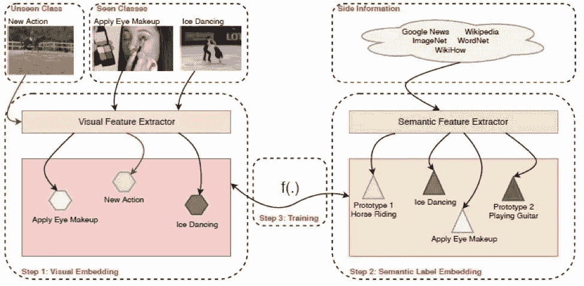
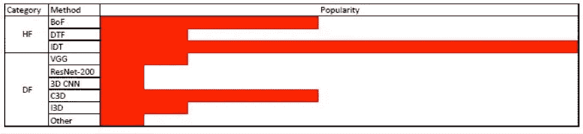
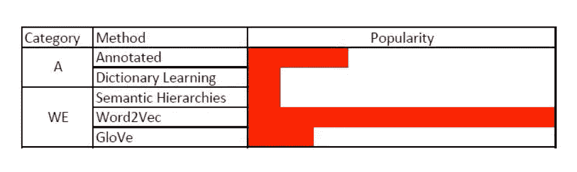
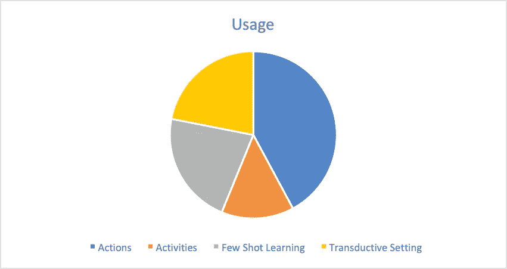
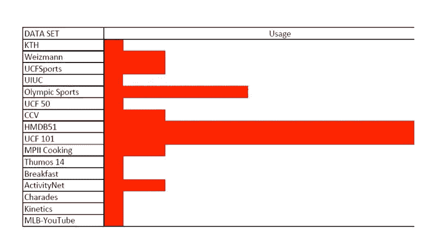

# 视频中零镜头动作识别综述

> 原文：<https://medium.com/analytics-vidhya/zero-shot-action-recognition-in-videos-a-survey-793cdfafbf1b?source=collection_archive---------23----------------------->

ero Shot Learning (ZSL)旨在从看不见的类别中识别对象，它是关于学习者从观察到的数据中识别不同类别的能力，而无需在训练阶段观察到此类数据。

我们都知道为训练目的收集、注释和
标记数据的过程是多么的费力。因此，对于利用能够对来自训练样本中不存在的类的实例进行分类的方法，存在许多要求/需求，特别是在视频中。

在这篇文章中，我的目的是提供一个全面的审查如何 ZLS，尤其是在视频中，阅读和相关的类可用于培训目的使用视觉和语义嵌入。

ZSL 的学习者读取数据，并与培训中可用的课程相关联，并进行误差估计以提供准确的输出。简而言之，ZSL 通过最接近可用数据类别的估计来识别动作。因此，该技术的准确性将受到来自训练模型的数据类的可用性的限制。为了克服这个障碍，ZSL 在不同映射技术的帮助下，同时使用了视觉嵌入标签和语义嵌入标签。

让我们详细阐述一下上述声明的含义:

V 视觉嵌入标签:视觉嵌入是理解图像并将其转化为机器可读代码的能力。在从大型图像数据集进行训练后，该模型通常会识别不同的动作，并尝试将其分类到可用的类别中，以提供一个结果。

语义嵌入标签:语义嵌入类似于视觉嵌入，唯一的区别是模型试图读取文字而不是图像，并在与可用数据集进行比较后对其进行分类。现在，在零起点学习中，这两者是如何发挥作用的呢？

图片来源:[https://arxiv.org/pdf/1909.06423.pdf](https://arxiv.org/pdf/1909.06423.pdf)

如上图所示，ZSL 所做的是提取视觉和语义信息，在类中识别它们，并执行映射功能。映射函数输出相对于可用类别估计的类别，并且具有最小误差的估计被识别为看不见的类别。

Z 例如，当静止图像受像素 x 像素的质量限制时，视频受像素 x 像素 x 每秒帧数的限制。这个额外的方面增加了问题的复杂性。因为解决方案是如我们上面讨论的将视觉和语义标签映射在一起，所以该方法受到三个属性的约束-
A)视觉嵌入和语义嵌入方法的效率
B)映射技术
C)使用的数据集

**A)** **视觉嵌入和语义嵌入技术**

视觉嵌入方法通常分为以下几类:

1.手工制作的方法

2.深度特征方法

所有使用的不同技术通常可以归入这两种方法中的任何一种。Valter Luís Estevam Juniora 等人从 100 多项已发表的研究中调查了这些方法的受欢迎程度，并得出如下分析，如下图所示:

对于语义嵌入方法也可以进行类似的分析。语义技术分为以下几类:

1.属性

2.单词嵌入

**B)** **映射技术**

映射技术大致分为:

1.基于属性的方法

2.单词标签嵌入

3.语义关系

4.对象作为属性

5.多模态学习

6.生成方法

这些方法可以根据在这些方法中考虑的方面来分解。这些方面可能包括，行动或活动，少数镜头学习方法，和直推式设置。将所有的方法组合在一起，并在饼图中将它们的方面分开，有助于我们对大多数方法中包含的方面有一个大致的了解。可以观察到，大多数方法都包含了动作方面。

**C)使用的数据集**
在训练模型期间使用的数据集被分类为在视频中执行的动作、视频的质量以及使用的视频的数量。研究人员使用的数据集可能因数据集中包含的类别而异，并且可能根据模型的应用选择使用不同的数据集。例如，根据模型的使用场合(烹饪节目或体育赛事)，可以为烹饪数据集(包含所有烹饪活动的数据集)或奥林匹克体育数据集(包含从事体育活动的人的视频的数据集)训练模型。出于一般目的，广泛使用的数据集是 HMDB51 和 UCF101。所用数据集的一般统计数据如下:

**结论:**

在这篇文章中，我试图介绍视频中动作识别的 ZSL 方法，如视觉和语义提取，几种弥合视觉和语义提取之间语义差距的方法/映射技术。也有一些零射击学习实验的数据集和它们的使用的一般统计。

**参考**

https://arxiv.org/pdf/1909.06423.pdf