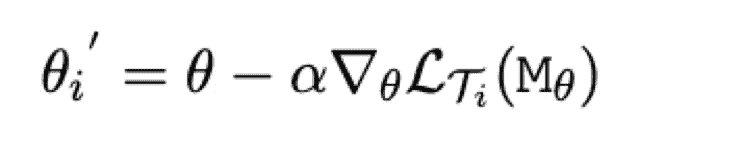
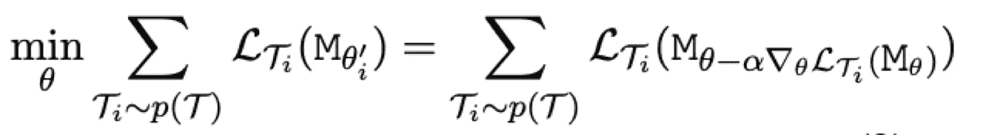
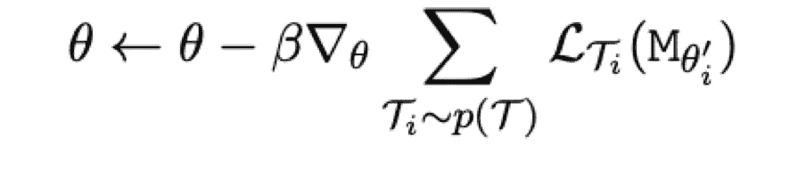
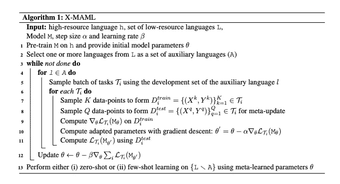
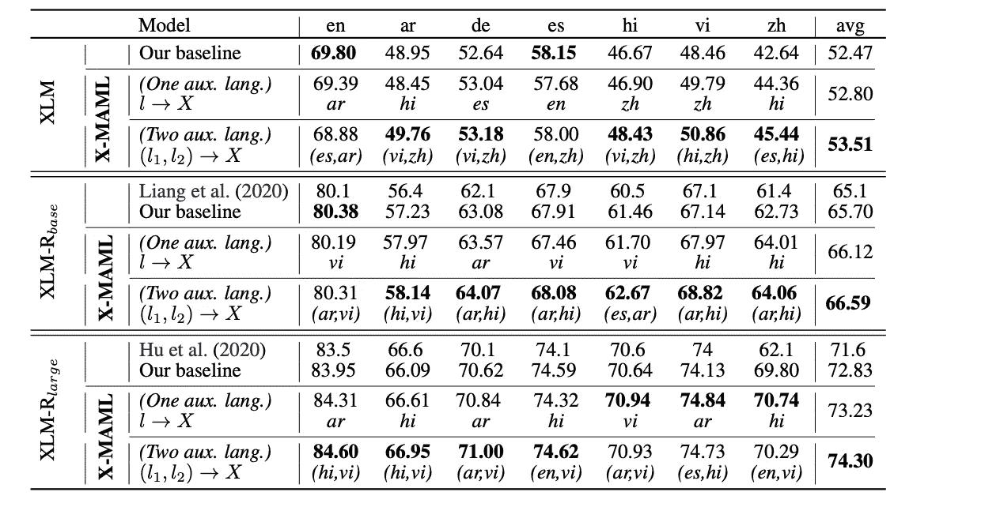
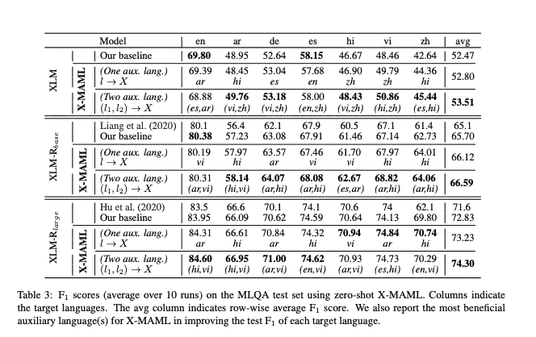

# 元学习下的零元跨语言迁移

> 原文：<https://medium.com/analytics-vidhya/zero-shot-cross-lingual-transfer-with-meta-learning-de053b7c5215?source=collection_archive---------24----------------------->

*原作者:法尔哈德·诺拉拉扎德、詹尼斯·贝库里斯、约翰内斯·比耶瓦、伊莎贝尔·奥根斯坦*

【https://arxiv.org/pdf/2003.02739.pdf】文章链接:[T5](https://arxiv.org/pdf/2003.02739.pdf)

*发布日期:2020 年 10 月 5 日*

图片:Unsplash/Andrew Stutesman

# **简介**

知识的战略性共享已经证明可以提高任务绩效。由于大多数语言资源不足，知识的战略性共享对于多语言应用变得非常重要。我们考虑建立一个除英语之外的多种语言的训练模型，在这种语言中没有数据或只有很少的数据可用。在本文中，我们将看到这个挑战可以通过使用元学习来解决。除了训练源语言模型，另一个模型学习选择哪个训练实例对第一个更有用。

所执行的实验是标准监督的、零镜头跨语言的，以及针对不同自然语言理解任务(自然语言推理、问题回答)的少量镜头跨语言设置。这些广泛的实验证明了使用总共 15 种语言的元学习的一致有效性。对于零炮、少炮 NLI 数据集，使用的是 MultiNLI 和 XNLI，在 MLQA 数据集上进行了质量保证。

错误分析部分表明，语言之间的类型特征的相关性可以在一定程度上解释通过元学习学习的参数共享何时是有益的。

# 文章的范围和背景

世界上有 7000 种语言，尽管如此，当涉及到自然语言理解任务时，很少有语言具有适当的语言资源。大多数自然语言处理研究仍然考虑用英语进行研究，XNLI 数据集证明了这一点。因此，这个问题的一个解决方案是收集带注释的数据，但这是一个耗时且不可行的过程。此外，用一种特定的语言为一项任务训练一个模型并将其直接应用于另一种语言也是很重要的，因为数据有限，所以探索允许使用大量训练数据(即英语)的策略变得至关重要，这样其他语言也可以受益。元学习最近被证明对机器学习任务是有用的。另外，对于 NLP，最近的工作显示了任务和域之间共享的有用性。该条的范围

1)提出了一个跨语言元学习架构(X-MAML ),并针对以下两个自然语言理解任务进行了研究

a)自然语言推理

b)提问和回答

2)测试 X-MAML 在跨领域、跨语言、标准监督、少镜头以及零镜头学习方面的能力，总共涵盖 15 种语言。

3)观察包括多语言 BERT 和 XLM-罗伯塔在内的强大模型的持续改进。

4)进行广泛的错误分析，发现跨语言趋势可以部分地由语言之间的类型共性来解释。

# 元学习

元学习是指在很少训练实例的情况下，能够快速学习新技能或适应新环境的过程。这是通过使用许多高资源任务重复模拟低资源任务的学习过程来实现的。有几种方法来执行元学习。

-基于度量:目的是在给定相似性度量的情况下，学习来自不同训练集的实例的特征表示之间的相似性

-基于模型:重点是调整学习速度快的模型(如记忆网络)

-基于优化:能够找到良好的初始化参数值，并快速适应新任务。本文考虑基于优化的方法。

模型不可知元学习(MAML)的使用已经在这篇文章中被开发，它使用梯度下降，并实现了对各种任务的良好推广。假设这些新的目标任务来自同一个分布，MAML 能够通过在测试时只使用几个实例来快速适应新的目标任务。

假设任务{T1，T2，…，Tk}的分布 p(T)在 MAML。对于特定的任务，比如说 Ti，从分布中采样的模型 M 的参数被更新为θi 0。具体来说，参数θ使用任务 Ti 的训练示例上的梯度下降步骤的一次或几次迭代来更新。例如，对于一个梯度更新，

在上式中，α是步长，Mθ是从神经网络学习的模型，LTi 是特定任务 Ti 的损失。通过训练模型θ的参数来完成跨任务 p(T)的看不见的测试示例(即，Dtest i)上的 Mθ 0 的性能优化。下面的等式表明了元学习的目标。

MAML 算法的目标是在一个新的也是元更新的任务上通过几个梯度步骤来优化模型参数。

下面的等式表明元更新在所有涉及的任务中使用随机梯度下降(SGD)对模型的θ参数进行更新。β是元更新步长。

# 跨语言元学习

这里使用 MAML(或任何 NLP 任务)的主要思想是使用一堆高资源辅助任务/语言来找到最佳初始化，从该初始化学习目标任务/语言可以仅使用少量训练实例来完成。当只有英语数据集可用作高资源语言，并且只有少量实例可用于其他语言(跨语言设置，即 XNLI，MLQA)时，用于 MAML 的训练过程需要相当大的改变。为此，跨语言元学习框架(XMAML)被引入。XMAML 使用以下培训步骤:

1)英语(高资源语言)上的预训练所有训练样本都是用高资源语言给出的，先在 h 上训练模型 M，初始化模型参数θ。

2)使用低资源语言的元学习:

-从低资源集中选择一种或多种辅助语言。

-使用每个辅助语言的开发集构建随机抽样的任务批 Ti。

-通过一个梯度下降步骤，使用 Ti (Dtrain i)的 K 个数据点更新模型参数

-在每个任务中使用 Q 个示例(Dtest i)计算损失值。应当注意，用于训练的 K 个数据点(Dtrain i)不同于用于测试的 Q 个数据点(Dtest i)。

-对所有任务的损失值求和，以最小化元目标函数，并使用第三个等式执行元更新。该步骤在多次迭代中执行。

3)对目标语言的零投或少投学习:

-这是 X-MAML 的最后一步，这里我们用元学习期间学习到的参数初始化模型参数。

-通过在目标语言的测试集上评估模型(即零触发学习)或使用目标语言的开发集通过标准监督学习微调模型参数并在测试集上评估(即少触发学习)来继续。在下面的算法中给出了所提出的模型 X-MAML 的更正式的描述)

**自然语言推理(NLI):**

使用 NLI，我们可以预测一个假设句是中性的，真的，还是假的给定一个前提句。MultiNLI(多体裁自然语言推理)数据集具有 433，000 个用文本蕴涵信息标注的句子对。这支持跨类型评估，有近 10 种不同的类型:面对面，电话，逐字，国家，政府，小说，信件，911，旅游和牛津大学出版社。这些类型出现在测试和开发集中，其中五个包含在训练集中。每种体裁的 NLI 任务都被定义为 Ti，以便更普遍地验证学习程序。正如本文前面提到的，MAML 是在其原始设置中开发的。并调查元学习是否鼓励模型学习所有目标体裁的良好初始化，然后可以在较少监督的情况下对每个体裁开发实例进行微调，以在其测试集上实现良好的性能。XNLI 数据集有 5000 个测试对和 2500 个开发对，带有英文文本标签，所有这些都提供了 14 种语言的翻译

法语(fr)、西班牙语(es)、德语(de)、希腊语(el)、保加利亚语(bg)、俄语(ru)、土耳其语(tr)、阿拉伯语(ar)、越南语(vi)、泰语(th)、汉语(zh)、印地语(hi)、斯瓦希里语(sw)和乌尔都语(ur)。

这个数据集还提供了一个基准来评估如何在低资源语言中执行推理。这个过程将允许我们研究使用一种低资源语言作为辅助语言的元学习的效果，并在 XNLI 测试集中提供的目标语言上评估由此产生的 NLI 模型。

**问题回答(QA):**

问答的任务是在回答问题的上下文中识别跨度。多语言问答数据集，包含 7 种语言的问答实例:英语(en)、阿拉伯语(ar)、德语(de)、西班牙语(es)、印地语(hi)、越南语(vi)和简体中文(zh)。它有超过 12k 的英语问答实例和 5k 的其他语言，每个问答实例可在 4 种语言。本文通过一种或两种辅助语言对问答系统的元学习进行了实验研究。

# 实验

主要的焦点是调查元学习如何用于跨语言的分享。使用高级库 2 的 XMAML 与 Adam optimizer 一起使用。对于零投和少投学习，使用 32 的批量。试验了一些不同的架构，以验证该方法在它们之间的通用性。结果给出了少数镜头，零镜头跨领域，跨语言学习

**NLI** :使用两种设置进行实验。

(I)对于跨类别数据集 MultiNLI，采用了增强型顺序推理模型(ESIM)。ESIM 注意使用逻辑推理来创造丰富的表达，捕捉前提和假设句子之间的关系。

(ii)对于 XNLI，使用 PyTorch 版本的 BERT，集成了 Hugging Face 的库作为底层模型 M，但是所提出的元学习方法是模型竞争的，并且它也可以扩展到其他体系结构

注:设置 i) MAML 适用，设置 ii)X-MAML 适用于原始英语 BERT 模型(En-BERT)和多语言 BERT (Multi-BERT)模型。

**QA** :问答使用 X-MAML 的基础模型 M，即 XLM(和 XLM-罗伯塔(XLM-R)。

提到的两个基线:(I)零测试基线:这个基线在目标语言的测试集上直接评估模型。(ii)少量基线:这个基线在开发集上微调模型，然后在低资源语言的测试集上评估。

## **1。少拍跨域 NLI**

在 MultiNLI 训练集上训练 ESIM，以提供初始模型参数θ。在 XNLI 的英语测试集(因为 MultiNLI 测试集不是公开可用的)上评估预训练模型作为基线。在 MAML 把每一种体裁作为一项任务。包括元学习期间的训练集(5 种类型)或发展集(10 种类型)。然后首先用 MAML 学习的参数初始化模型参数。后来，实验继续使用 MultiNLI 的开发集对模型进行微调，然后在 XNLI 的英语测试集上报告准确性。随着更多实例的出现，所有模型(包括基线)的性能都会提高。

## 2.零杆和少数杆跨语言 NLI

**零触发学习:**零触发学习:XMAML 框架集成在零触发设置中。此后的元学习步骤没有针对每种目标语言的元学习的微调和影响，因为在测试集上报告了在基线模型(Multi-BERT)之上有和没有元学习的准确性差异。通过对每种目标语言使用一种辅助语言来报告平均和最高性能。通过在 X-MAML 中使用两种辅助语言，在我们的零射击实验中获得了最大的收益。

**少镜头学习:**通过微调在目标语言的开发集上进行 X-MAML 的元学习，然后在测试集上进行评估。将 X-MAML 结果与一种或两种辅助语言的内部和外部基线进行比较。

## 3.零镜头跨语言问答

一种类似的方法用于 MLQA 数据集上的跨语言问答。MLQA 的零炮结果如下所示。所有目标语言都受益于至少一种辅助语言的元学习。在 X-MAML 中使用两种辅助语言可以改善结果。简而言之，使用 X-MAML 的零起点学习模型优于内部和外部基线。

F1 分数(平均超过 10 次运行)在 MLQA 测试集使用零杆 X-MAML。列表示目标语言。avg 列表示行平均 F1 分数。我们还报告了 X-MAML 在提高每种目标语言的 F1 测试中最有益的辅助语言。

## 相关著作

这项任务的主要灵感来自世界上大多数语言的较少可用的标记训练数据集。为了解决这个问题，已经提出了许多方法，包括少量学习。少镜头学习方法最近被应用于自然语言处理任务。具体来说，在 NLP 中，这些少量学习方法包括将问题转化为不同的任务或元学习

**元学习:**元学习或学会学习最近受到了 NLP 社区的广泛关注。

**跨语言 NLU:** 跨语言学习在自然语言处理中的历史相当短，并且主要局限于传统的自然语言处理任务，例如词性标注、形态变化和句法分析。

# 讨论和分析

跨语言迁移:跨语言迁移和元学习产生了更好的结果，即使语言之间有很大的差异。这表明用 X-MAML 学习的元参数是充分的语言不可知的。这取决于能否获得预先训练的多语言模型，如 BERT，尽管单语 BERT (En-BERT)在一些目标/辅助设置中具有非常积极的增益。对于少量学习，发现仍然相似。

类型学相关性:文章提到了类型学特征的研究，以及它们在目标语言和辅助语言之间的重叠，以便更好地解释跨语言零习得和少习得的结果。世界语言结构地图集(WALS)被评估(这是最大的公开可用的类型学数据库。文章提到从现有的工作中获得灵感，这些工作试图基于在各种 NLP 任务下学习的语言表征来预测类型学特征。在实验中使用了两个条件:(I)尝试使用 X-MAML 基于性能中的相互增益/损失来预测类型学特征(ii)在所研究的情况中，在两种类型学相似的语言之间的共享有助于使用 X-MAML 的性能。在某些情况下，发现语言共享 WALS 特征 25A 标记位点的特征值:全语言类型学通常互相帮助。这一特征描述了一种语言的形态句法标记是依赖于短语还是句法中心。例如，en、de、ru 和 zh 在此功能中是“相关标记”。因此，人们发现，当使用 X-MAML 时，具有相似形态句法属性的语言可以相互受益。

# 结论

在这篇文章中，我们看到元学习可以有效地利用来自辅助语言的训练数据进行零元和少量元的跨语言迁移。文章谈到了对两个具有挑战性的 NLU 任务(NLI 和问答)和总共 15 种语言的评估。此外，我们还讨论了零炮 XNLI 和零炮 QA 在 MLQA 数据集上的最新基线模型的性能改进。

此外，文章表明，在类型学分析中，语言共享某些形态句法特征往往会从迁移类型中获得优势。本文将进一步将这一研究/工作扩展到其他跨语言的 NLP 任务和更多的语言。

# 参考

更多资源可以在主文章中找到。

Mostafa Abdou、Cezar Sas、Rahul Aralikatte、Isabelle Augenstein 和 Anders sgaard。2019.X-WikiRE:作为机器理解的关系抽取的大型多语言资源。《第二届低资源 NLP 深度学习方法研讨会论文集》(DeepLo 2019)，第 265–274 页，中国香港。计算语言学协会。

泽利科·阿吉奇和娜塔莉·施鲁特。2018.跨语言推理的基线和测试数据。在 LREC。欧洲语言资源协会(ELRA)。

戴维·m·埃伯哈德、加里·f·西蒙斯和查尔斯·d·芬尼格。2019.民族志:世界语言。[https://www.ethnologue.com/](https://www.ethnologue.com/)统计/规模。访问时间:2019–05–25。