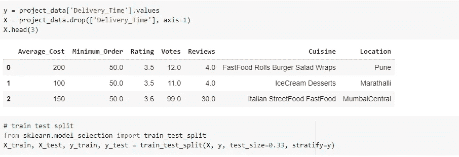
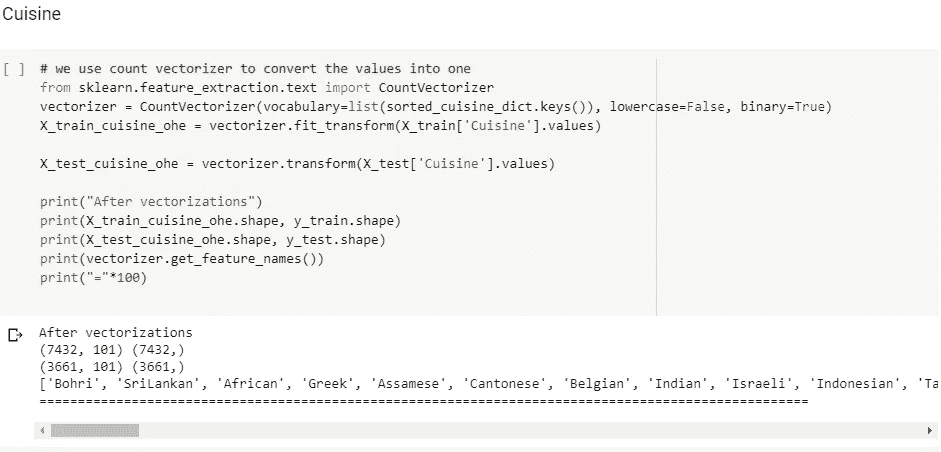

# 从零到英雄:机器学习竞赛

> 原文：<https://medium.com/analytics-vidhya/zero-to-hero-machine-learning-competition-4704cb374b28?source=collection_archive---------12----------------------->

> 好的谷歌..如何解决一个黑客马拉松？好的，谷歌..高精度解决机器学习挑战的技巧..

如果每次参加新的数据科学竞赛时，你都有这种强烈的谷歌搜索欲望，那么这篇文章正适合你。试着忍耐到最后，我可以向你保证，从下一次开始，你将不会对任何类型的机器学习挑战感到陌生或不舒服。
嗯..一切听起来不错。现在让我们开始吧。

今天我们要经历一次真实的机器学习挑战，它是由 MachineHack 在 2019 年 11 月发布的。这次挑战的名称是“**预测食品配送时间**”，由 IMS Pro School 组织。
我之所以将这次黑客马拉松作为参考示例，是因为当我经历这次挑战时，我发现这是一次平均水平的挑战，维度更少，解释能力更高，数据形式受监督。迷茫了？不要担心，前面的旅程是以任何初学者都可以从中受益的方式构建的。

首先，我们先把网上得到的训练数据(csv 文件)导入。

现在，在对数据集进行预处理和应用所有有趣的技术之前，每个人需要做的就是**等待..观察..明白；理解..**即使你认为你理解了数据集，也要等待，放松，再观察一次。

> 事实上，这是你很难在任何在线/离线平台上找到的东西，但观察和理解领域是每个 ML 工程师或数据科学家应该经历的最重要的步骤。在现实世界的项目中，有时领域专家会发挥作用以获得更好的洞察力。

在熟悉了这个领域之后，现在让我们做一些观察。
**给你来个任务**。不要继续滚动或阅读，从数据集中做出你自己的一套观察结果，并把它写在某个地方。以后看我的，自己评价。如果你有任何独特的观察，请在评论区提出来，因为我很想看到它。

让我把我的理解分成不同的层次，这样你就能更好地理解了:

***初学者*** :去掉前缀“？”从平均成本和最小订单。从 Delivery_Time 中删除后缀“分钟”。从完整的地址中提取城市名称，否则会过度训练我们的数据模型。

***中间*** :去掉菜名中的逗号，然后去掉菜名中有多个单词的空格(例如将快餐转换为 FastFood 或 Fast_Food)。这背后的想法是，稍后在将我们的数据维度转换为向量形式时，我们将把每个独特的菜名转换为不同的维度/列。
寻找每个维度的所有独特价值，以便更好地理解。

***高级*** :删除餐馆列，因为它对我们的预测没有用处，只会过度训练我们的数据模型。
寻找数据集中所有缺失的值，然后通过插补技术进行填充，如果列中有任何字符串值为整数值，则相应地进行修正(例如，将 1，200 转换为 1200)。

**干得好，**您已经完成了构建模型最繁琐、最肮脏的部分。
现在让我们再来看一下我们的数据集*，但这次是用图形显示的。*

从交付时间图来看，我们可以说 10 分钟的发生次数最低，120 分钟的发生次数最高。

> 看起来不像是可靠的送餐服务😆

***精彩*** ..所以我们现在所做的被称为数据预处理和探索性数据分析。现在让我们升级游戏。是时候将数据转换成向量，然后在我们的模型上应用预测算法，最后进行预测了。

但在此之前，我们需要先将我们的数据拆分成训练数据和测试数据。这里，我们的因变量将是交付时间(称为 y)，其余的将是自变量(称为 X)。

> **要确保的一件重要事情是，在对我们的模型进行矢量化时，我们将只在训练数据上拟合矢量器对象，因为我们需要在训练数据的基础上从测试中进行预测。在测试中拟合矢量器会使算法在预测之前熟悉测试数据，因此会导致模型过拟合。**
> 
> **你可以做的另外一件事是，在对每个独立变量进行矢量化之后，对该变量和因变量应用预测算法，以查看该变量在进行预测方面的有效性。在这里，我会给你看一个。**

************

> **永远记住一件事，对于文本数据，我们将其矢量化，对于数字数据，我们将其标准化/规范化。我建议您在继续下一步之前，先了解一些标准化或规范化的知识。**

****

**将所有因变量分别矢量化后，将它们组合起来形成一个数据框。**

**现在让我们对数据应用一些算法，看看哪种算法效果最好。**

> **你可能已经注意到，每场黑客马拉松都持续了大约 2-3 周的时间。在这段时间内，每个申请人主要做的是对模型应用不同类型的算法(具有唯一的一组最佳参数),并查看哪种算法能够以最小的损失/失败进行预测。**

**这里，我使用的所有算法是:**

> ***K-最近邻
> 逻辑回归(我个人最喜欢)
> SVM
> 随机森林
> XGBoost***

*****注意*** ！！现在我将与你分享每个参与者用来获得最大准确性的秘密/技巧。这是初学者中很少有人熟悉的东西(如果你熟悉的话，那就太好了),诀窍是使用合奏。**

****

> **Ensemble 是一个法语单词，在英语中是一起的意思，Ensemble 的应用也是如此。
> 在继续下一步之前，请获得一些关于合奏的基本知识。**

**在系综中，我们使用堆叠技术。
**工作原理**假设我们有一个独立变量 X，我们使用 3 种算法，即 K-NN、随机森林和 SVM。所以堆叠会把 X 的一部分馈给 K-NN，一部分馈给随机森林。这些模型的输出将作为 SVM 的输入，我们希望哪个算法作为基础算法或主算法完全取决于我们。通过这种方式，我们使我们的模型稳健且高度准确。**

> **尽管系综是一种非常有效的提高准确性的技术，但它仍然没有在现实世界的项目中使用。
> 纳闷为什么
> 原因很简单。使用集成的训练模型需要大量的时间和计算资源。在比赛中，我们关心的是高精度，而不是计算时间或硬件，但在现实世界中，这对企业来说成本很高，因此不是一个可行的选择。**

****

**我们已经在模型上应用了堆叠，现在是旅程的最后一部分。
现在根据独立数据预测因变量。然后计算因变量的预测数据和实际数据之间的精度。
对训练和测试数据执行该步骤。
注意:如果训练的准确度非常高，而测试的准确度非常低，那么再次检查你的模型，因为它已经训练过度了。如果训练和测试精度都很低，则意味着模型训练不足。
理想情况下，训练和测试的准确度差异不应该很大，并且两者的准确度都应该很高。**

**如果你的模型已经达到了那个理想阶段，那么是时候在 Test.csv 上做预测了。**

> **就像我们对 Train.csv 所做的那样，类似地执行上传= >预处理= >矢量化= >模型应用= >集成(堆叠)，然后进行预测。
> **所以做 Test.csv 是你们所有人测试自己技能的家庭作业**。**

*****恭喜*** …。你已经获得了所有必要的信息，可以用比赛中给出的数据做出最好的预测。**

**如果你觉得这篇文章有趣或有帮助，请通过 clap 表示你的支持，并请在评论区告诉我你对此的看法。**

**请记住…**

> **使你成为真正英雄的不是你做了什么，而是你如何做。**