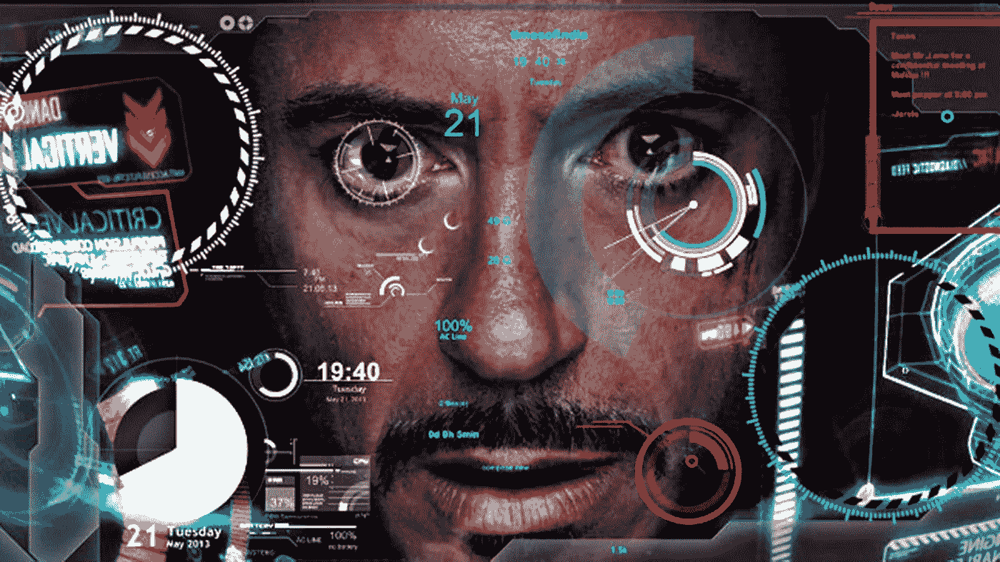
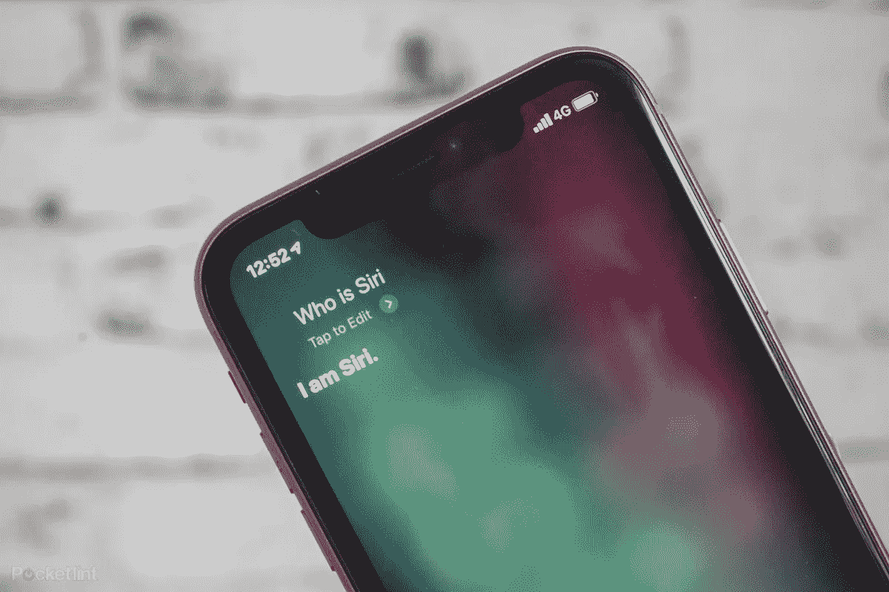
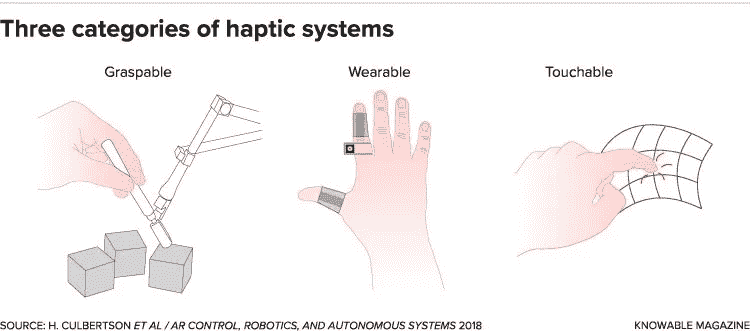
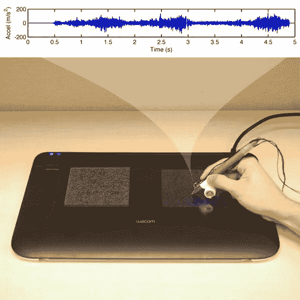
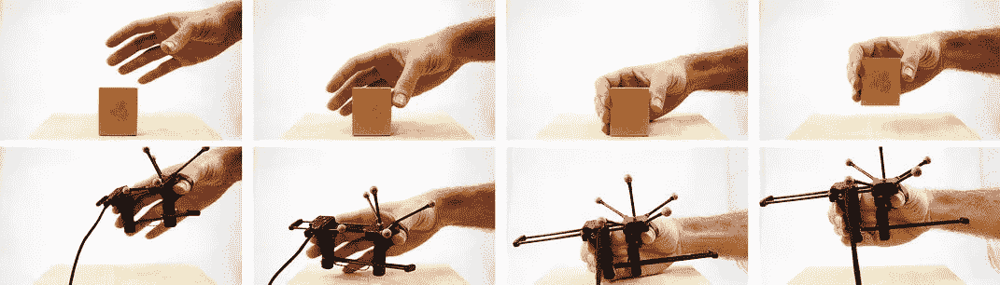
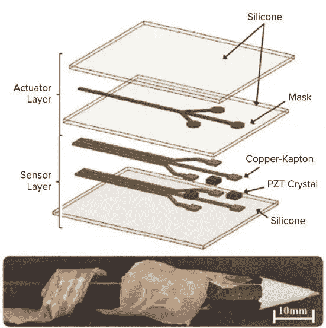

# 技术的未来？

> 原文：<https://medium.com/analytics-vidhya/zero-user-interface-a7c9ef548bf?source=collection_archive---------22----------------------->

*世界永远是***在变。**

*谁会想到 40 年前**地球上几乎每个人都会有一台**电脑，比我们口袋里用来带第一个人登上月球的电脑还要强大**？***

***我们未来使用的技术将与今天相比发生巨大变化。***

***很有可能在不到 **20 年的时间里**我们最常见的科技产品**甚至不会有屏幕！*****

## ***这种从屏幕到更具交互性的用户交互方式的转变被称为零用户界面(或零 UI)。***

******

***这看起来像是钢铁侠或科幻电影里的东西，不是吗？***

***现在，零用户界面可能看起来都是这样，但今天有一些人们离开屏幕的例子。以苹果的 Siri 或谷歌的 Alexa 为例。两个声控软件的完美例子。***

******

***零用户界面就是远离屏幕。无论是通过**触觉技术**，语音控制**，计算机视觉**，还是人工智能。***

***今天，在本文中，我将重点讨论触觉技术和计算机视觉，这是两项最被低估的激动人心的新兴技术。***

***让我们直接进入技术成为我们生活一部分的最引人入胜的方式之一。***

# ***触觉技术***

> ***一项创造触觉的技术***

***触觉技术能够并将会彻底改变从时尚到医疗行业的无数领域。想象一下你能在网上**感受你想买的那条新牛仔裤的面料**。或者外科医生能够从**远程**位置对患者进行**手术，而**不必在那里**。*****

***这项技术已经在我们的日常生活中首次亮相。你可以在游戏控制器或手机上感受到的振动就是这种技术的很好的例子。***

***触觉技术有三种类型:***

*   ***可触的***
*   ***衣服***
*   ***能理解的***

******

***鸣谢:斯坦福形状实验室***

## ***可触摸触觉技术***

***今天你能看到的最常见的技术是**可触摸触觉技术。*****

***这种技术的一个很好的例子是在你的设备上模仿某些纹理，这将在未来几年内出现。***

***Heather Culbertson 是可触摸触觉技术的具体应用的领导者之一。通过记录笔以不同的速度和压力划过表面时的反应，希瑟能够模仿触摸屏表面的感觉。她称之为**数据驱动触觉。*****

******

***用笔信用在触摸屏设备上显示可触摸触觉技术的例子:斯坦福形状的梯子***

***随着技术的不断涌现，这项技术的工作可能不再需要屏幕。***

## ***可抓握触觉技术***

***这个话题的另一个更令人兴奋的形式是**可抓握触觉技术。*****

***可抓握触觉技术通常在不同的尺度上模仿物体的感觉。这项技术可以发挥作用的一个例子是与机器人或无人机等其他技术相结合。***

***想象一下，能够使用触觉技术控制机器人，并且能够准确地感觉到机器人正在触摸什么。***

***控制机器人机械的操纵杆可以让你感觉到阻力，这是使用可抓握触觉技术的一个很好的例子。***

***创建更多身临其境的可抓握触觉技术设备的最大问题是试图模仿物体的重量。这就是创建 **Grabity** 的原因。***

***Grabity 是一种可以用来抓住和挤压虚拟对象的机制，使这些对象看起来好像有重量。***

******

***Grabity，由斯坦福大学形状实验室创作***

## ***可穿戴触觉技术***

***可穿戴触觉技术通常可以与虚拟现实一起使用。***

***想象一下，能够在虚拟现实中用铅笔写字，能够感受到铅笔对纸张的压力。***

***使用这种技术的设备已经制造出来了。当你触摸屏幕上的物体时，你可以通过触摸来感知这些物体。***

***同样，一种形状几乎像戒指的新的可穿戴触觉设备也席卷了世界。该对象在其构建中具有马达，以向用户提供更沉浸的虚拟体验，同时仍然能够与现实生活中的对象进行交互。***

***最后，对于世界各地的许多人来说，帮助听力损失者的可穿戴背心是一个令人兴奋的机会。这件背心将通过使用振动来工作，允许这些人理解对他们说的话。***

***理解这件背心的工作原理有点困难。传感器层和操作层由硅树脂隔开。在这种设备中，PZT 允许计算机理解施加在设备上的压力，并将其转换为反馈。这允许用户输入到计算机中。操作层有充满空气的微小区域，允许根据设备需要执行的内容发生振动。***

******

***鸣谢:H.A. Sonar et al / *机器人和人工智能前沿* 2016***

# ***计算机视觉***

> ***人工智能领域中的一种技术，允许计算机理解我们周围的世界***

***自动驾驶汽车中最常用的最令人兴奋的技术之一是计算机视觉。自动驾驶汽车需要了解周围的情况，这就是为什么它们必须使用计算机视觉。***

******

***学分:走向数据科学***

***计算机视觉的工作方式类似于解决拼图游戏。该设备通过图像的边缘和其他属性来识别图像的某些部分，以检测某些对象。它观察像素组，看它们形成了什么。***

***为了让设备理解什么是什么，需要机器学习。通过输入数百条数据，计算机将能够破译看起来像其他物体的物体，并对它们进行分类。***

***从医学到零售的许多领域都可以使用计算机视觉。***

***在放射学中，计算机视觉可用于检测 ct 扫描或 MRI 中的异常。***

***随着计算机视觉的引入，零售可以更容易地看到商店中哪些商品缺货。***

## ***计算机视觉分三步工作:***

1.  ***拍摄聚焦区域的图像***
2.  ***基于输入的数据，通过机器学习来处理图像***
3.  ***确定图像内的对象***

***世界上许多人都感觉到了这项技术的出现。***

> ***计算机视觉是深度学习和人工智能世界中最了不起的事情之一。深度学习对计算机视觉领域的贡献确实使这个领域与众不同。***

*   ***韦恩·汤普森，SAS 数据科学家***

## ***计算机视觉和触觉技术的用途确实是无限的。***

***一个没有屏幕的世界即将到来！你准备好迎接注定要发生的改变了吗？这种改变将会影响全世界数百万人的生活。***