# 使用 Zomato 数据的 Bengaluru 地理空间分析

> 原文：<https://medium.com/analytics-vidhya/zomato-geospatial-analytics-of-bengaluru-66cdc1b94de7?source=collection_archive---------12----------------------->

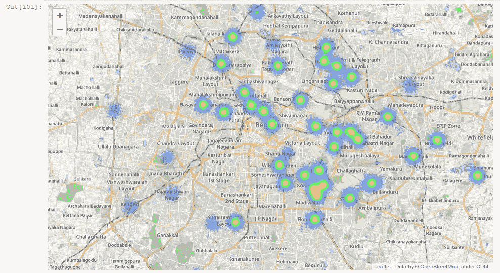

执行地理空间分析后，孟加拉鲁鲁的餐馆

***佐马托*** *是一家印度餐厅聚合商和送餐初创公司，由 Deepinder Goyal 和 Pankaj Chaddah 于 2008 年创立。* ***Zomato*** *提供信息、菜单和用户对餐厅的评价，以及所选城市中合作餐厅的送餐选择。*

> G **地理空间分析**是图像、全球定位系统、卫星摄影和历史数据的收集、显示和处理，当它们应用于地理模型时，用地理坐标或街道地址、邮政编码或林分标识符来明确描述。

***让我们看看我们的数据***

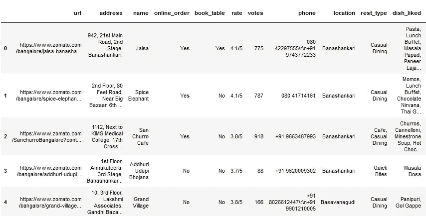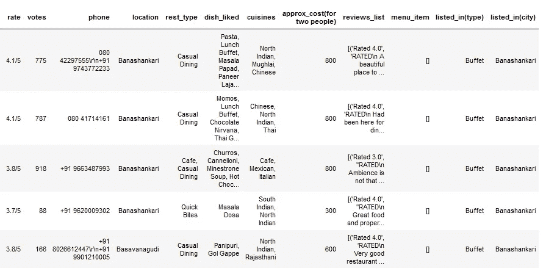

包含 5717 条记录和 17 个特征的数据

# **用于分析的数据预处理**

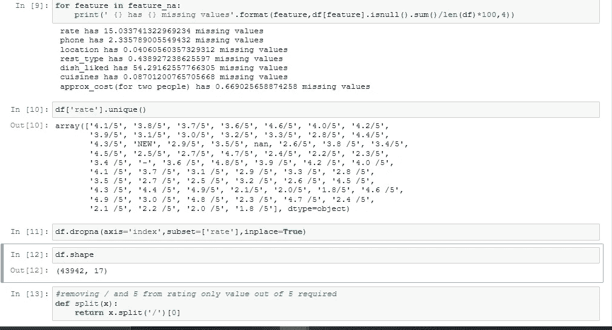

由于“4.1/5”不是有效的格式，因此现在无法分析数据集的“rate”等特征，因此我们将从该格式中提取 4.1，因为“/5”对于所有行都是常见的，我们可以说这些评级是满分 5 分。我们还需要转换数据类型。由于在给定的数据中“速率”被表示为“对象”，所以我们必须将其转换为“浮点”格式。另一方面，我们需要用 0 替换**缺失值**，如‘NEW’，‘nan’或’-，这样就不会给后面的分析带来问题。

# **寻找分布类型**

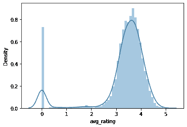

该图是使用 ***Seaborn*** 库绘制的，该图显示 **50%** 的餐厅的评分在 3 到 5 之间。一些餐厅显示评级为 0，因为它们是新的，4.5 星级的餐厅非常罕见。

.

# 对餐馆的深入分析

现在，我们将了解有多少餐厅提供预订服务，以及哪些餐厅接受在线订单。

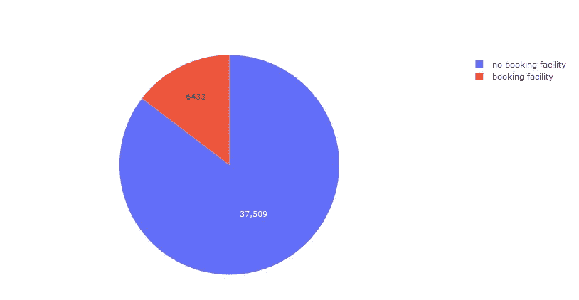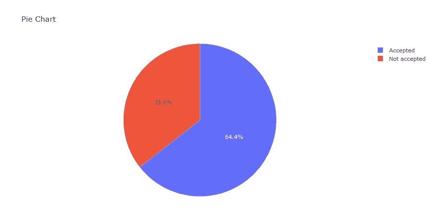

从上面的饼图中，我们可以得出结论，85.4%的餐厅没有提供预订服务，而只有 14.6%的**餐厅提供预订服务。**

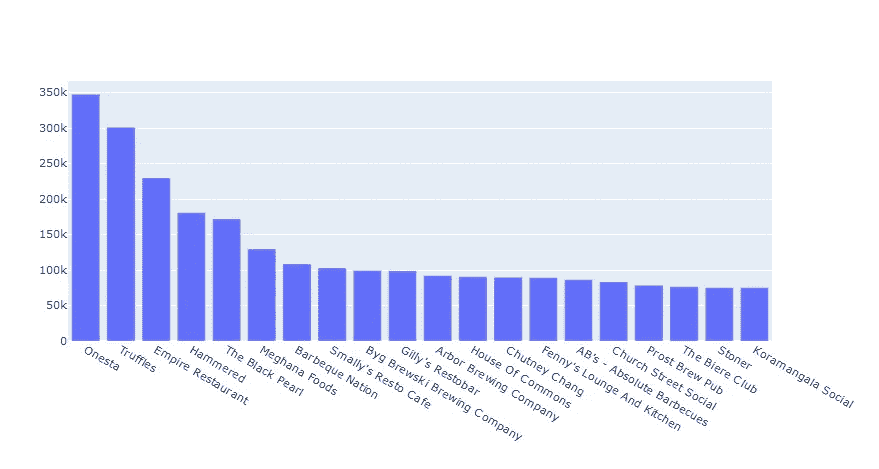

投票率最高的 20 家餐厅

在分析了 20 家最高票数的餐厅后。我们发现餐厅**‘奥涅斯塔’**的票数最高，即大约有 35 万人投票给这家餐厅。接下来是“松露”、“帝国餐厅”、“锤子”、“黑珍珠”等..

## 分析位置明智的餐厅分布

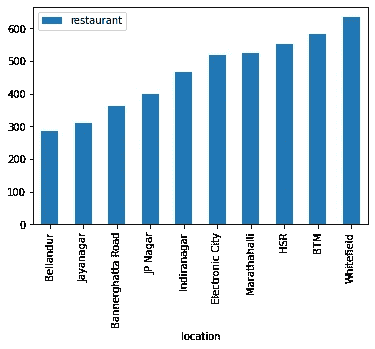

我们正在创建一个数据集，其位置映射到一个键，并与 ***唯一的*** 餐馆的数量相对应，并通过 **sum()** 函数对其进行计数。根据“餐厅数量”和“位置”之间的图表，我们可以说“Whitefield”区域的餐厅数量最多，即超过 600 家。

.

## 分析餐馆的菜系和价格

用 ***plotly*** 库绘制菜系和它们各自的计数我们知道它们是*【北印度】*菜系对其他菜系的统治。此外，中国菜在孟加拉鲁鲁人当中并不太受欢迎。

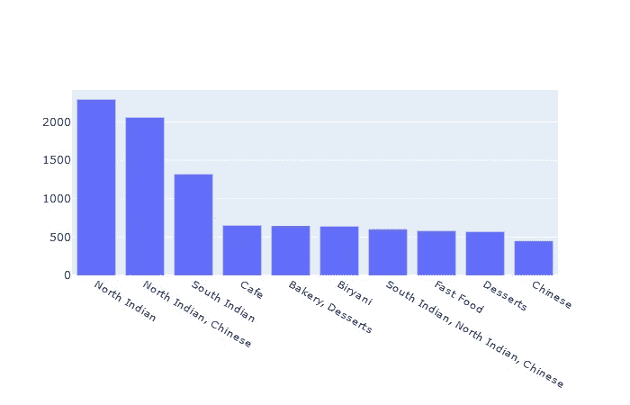

菜肴类型及其数量

将“approx _ cost(for two person)”的数据类型从“object”更改为“int”后，现在我们可以使用该数据来查找该地区价格合理的餐馆。我们正在使用 ***Lamda*** 函数，用空格替换一些垃圾值。

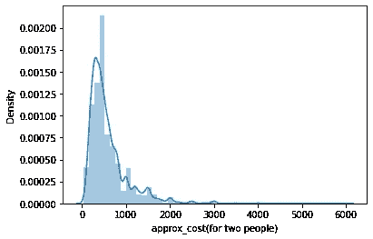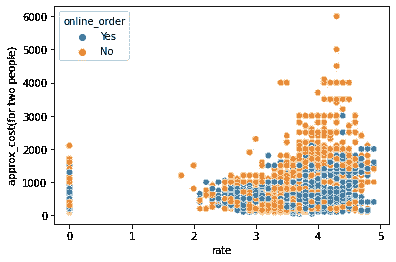

从上图中我们可以得出结论，大约 60%的餐馆在 Bengaluru 是负担得起的，从第二个散点图中，我们可以说评级在 3 到 5 之间的餐馆是相当昂贵的，大多数 m 提供在线订购设施。

# **分析孟加拉最著名的餐馆**

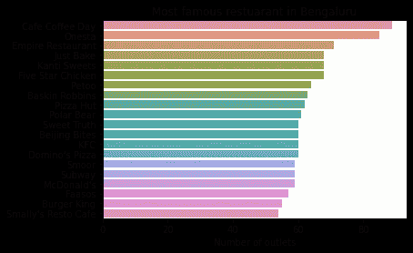

通过计算餐厅的数量，我们绘制了餐厅和餐厅数量之间的条形图。根据条形图，我们可以说“咖啡馆咖啡日”和“奥涅斯塔”是本加卢鲁最著名的餐厅，有 80 多家分店。

.

## 孟加拉鲁鲁所有地点的平价餐厅

在这里，负担得起是指评级超过 4 级的餐厅，两个人的费用大约等于或低于 400 卢比。

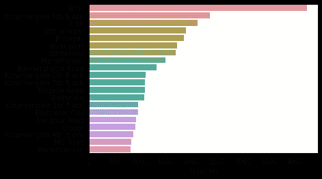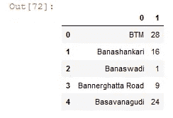

餐馆的位置和价格

也可以在特定地点找到最好的经济型餐厅。在这种情况下，我将面积设为' **BTM** ，类型设为 ***'* 速食'。**根据下面的结果，我们可以说,wadista Aahar，Litti Twist’、Shawarma 商店、Gorbandh、Yum In My Tum、Chaatimes、mutha shy’s、Swad Punjab Da、
Domino's Pizza、Roti Wala 和 Andhra Kitchen 是该地区最好的经济型餐厅。

# **执行空间分析**

为此，我们需要一个名为 ***geopy 的包。*** 这个库将帮助创建一个应用程序来获取地图数据并显示在窗口中。这个应用程序是使用**命名**创建的。随每个请求一起发送的 Http 请求标头。*nomim*要求将该值设置为我的应用程序名。您可以使用 http 请求头来使用此函数，该请求头随每个请求一起发送。*nomim*要求将该值设置为您的应用程序名称。此外，这个包将提取给定位置的纬度和经度。

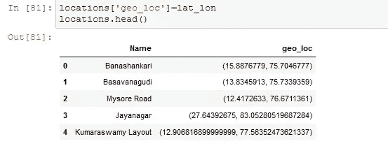

位置及其坐标

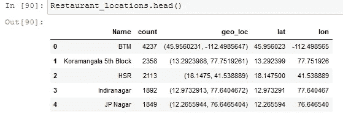

找到纬度和经度后，我们需要将餐馆的数量添加到数据帧中，并合并位置以获得新的坐标。如你所见，纬度和经度由一个“逗号”隔开，所以我们将把它分开。如图所示。

## 使用薄层绘制数据点

是一种发送/接收 http 请求的接口，但是我们需要一个地图来显示所有的数据点。 ***叶子*** 通过使用一个名为 ***generatebasemap()的函数来帮助绘制这些点。*** 因此，创建底图后，我们将绘制数据点并显示餐馆所在区域的热图。

孟加拉鲁鲁的餐馆

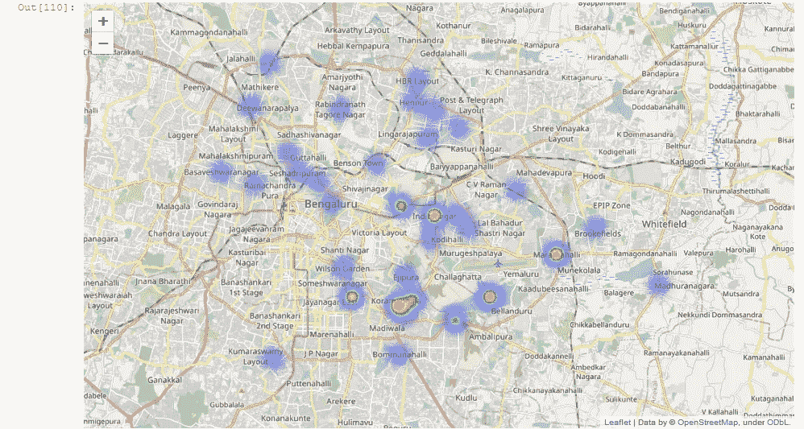

北印度餐馆热图

## 顶级休闲餐厅

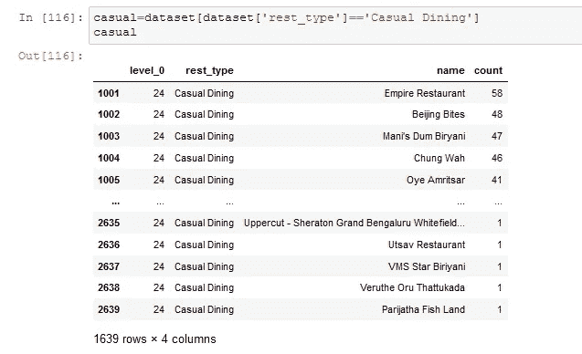

从输出窗口中，您可以看到“Empiring Restaurant”、“Beijing Bited”、“Mani's Dum Biryani”是孟加拉鲁的顶级休闲餐厅。

通过以下方式与我联系:

 [## ammy20019 -概述

### 在 GitHub 上注册你自己的个人资料，这是托管代码、管理项目和构建软件的最佳地方…

github.com](https://github.com/ammy20019)  [## 艾米特·库马尔·萨胡-助理设计师-开放社区 Rudra | LinkedIn

### 查看艾米特·库马尔·萨胡在全球最大的职业社区 LinkedIn 上的个人资料。阿米特有 4 个工作列在他们的…

www.linkedin.com](https://www.linkedin.com/in/amit-kumar-sahu-7aab19169)