# 嘿，佐马托，普纳卡人在哪里吃饭？？

> 原文：<https://medium.com/analytics-vidhya/zomato-pune-3884fb98011a?source=collection_archive---------16----------------------->

## Zomato 上市的 Pune 餐厅的数据清理和 EDA

我们会回到过去的常态吗？大概不会。这是我们的新常态吗？绝对不会。！！但我们知道的是，目前，我们不能和朋友一起去餐馆品尝我们喜欢的菜肴。因此，在我们进入新常态之前，让我们挖掘数据，也许能找到一个聚集的地方……**或者摆脱*乔伊*喜欢披萨的误解..不要..在浦那，乔伊更爱比亚尼！！！！**

以下是我们将要回答的一些问题-

1.  浦那**最大的连锁**是哪家？是麦当劳吗？还是咖啡馆咖啡日？还是多米诺骨牌？
2.  **比尔亚尼？还是披萨**？普内卡斯喜欢什么？
3.  **没钱了**？需要找到预算最好、评论和评分令人印象深刻的餐厅吗？
4.  **好得难以置信**？？有很多评论，但是评分并没有反映出来？

我搜集了大约 300 页的 Zomato 资料。
在深入研究数据之前，以下是数据集和笔记本的链接-

```
1\. Dataset - (of around 5000 restaurants)
[https://www.kaggle.com/nagar500/pune-restaurants-zomato](https://www.kaggle.com/nagar500/pune-restaurants-zomato)2\. Data cleaning and Visualization Notebook (for more visualizations)— [https://www.kaggle.com/nagar500/pune-zomato-restaurants-analysis](https://www.kaggle.com/nagar500/pune-zomato-restaurants-analysis)3\. Data scraping code -
[https://github.com/Akanksha321/Data-Analysis-with-Web-Scraped-data---Python/tree/master/Zomato%20Pune%20Restaurants%20Analysis](https://github.com/Akanksha321/Data-Analysis-with-Web-Scraped-data---Python/tree/master/Zomato%20Pune%20Restaurants%20Analysis)
```

# 数据清理

1.  正在清除列值。
2.  提取某些列的数字，如评论、费用。
3.  删除重复值。

让我们看看我们的数据是什么样子的—

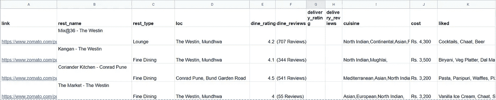

我们数据集的一瞥

你知道，就像他们说的，垃圾进垃圾出..该数据也有一些问题，因此在进行任何分析之前，我们需要清理该数据。
1。 **Rest_name** :好几个餐厅名字的末尾都有特殊字符(\r\n)。这个需要去掉。
2。 **Cost，dine_reviews，delivery_reviews** :我们需要从这些列中提取数字部分，然后将这些列转换为 integer 或 float，以便在分析中使用。

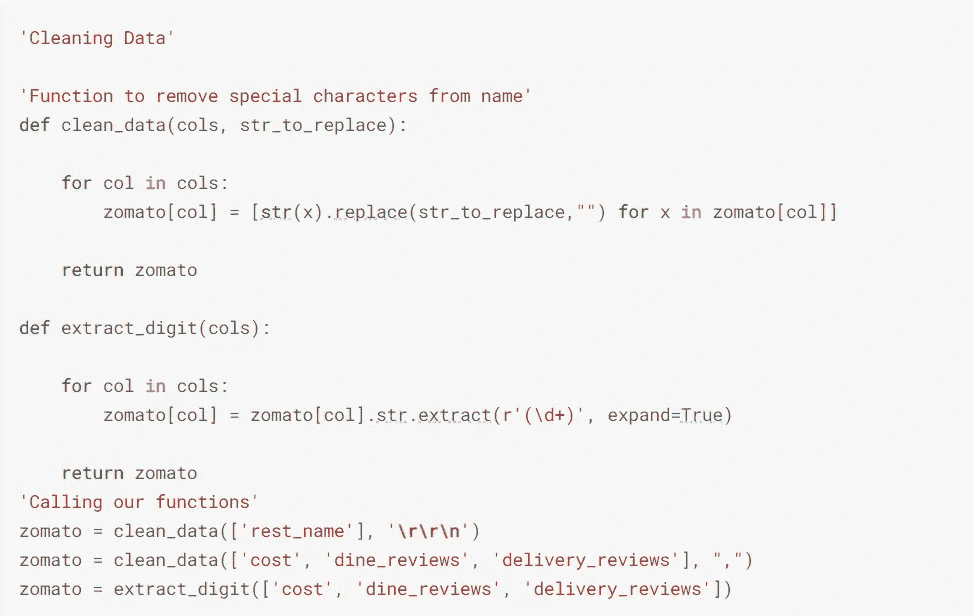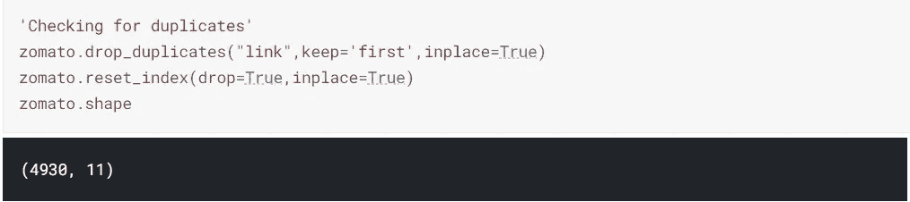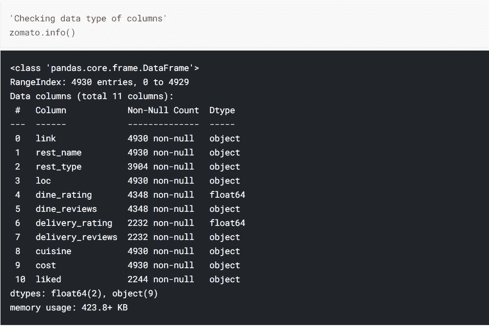

```
On checking for data types, we can see that below columns are not integer/float. These should be numeric columns - 
1\. dine_reviews
2\. delivery_reviews
3\. cost
```

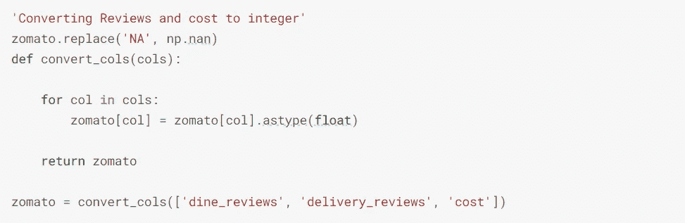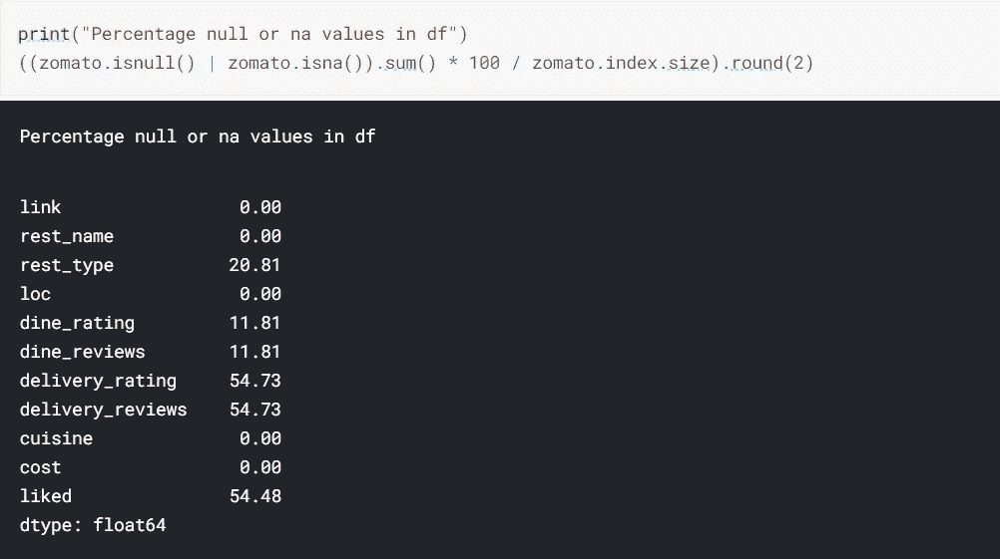

我们可以看到**交付评级、交付评论和喜欢的**有最大的缺失值。这些值中有一半以上都丢失了。以下是我对这些缺失数据的假设。**外送栏目** —很多高端餐厅没有外送选项。因此，如果缺少这些值，我认为这个值是不可用的，因为这些餐厅可能只在餐厅用餐。
2。这个专栏告诉我们大多数顾客喜欢的食物。这可能会因为审核数量不足而遗漏。

# 数据可视化

现在，既然我们已经完成了基本的数据清理，让我们开始绘图。

# 浦那的最大门店数量？

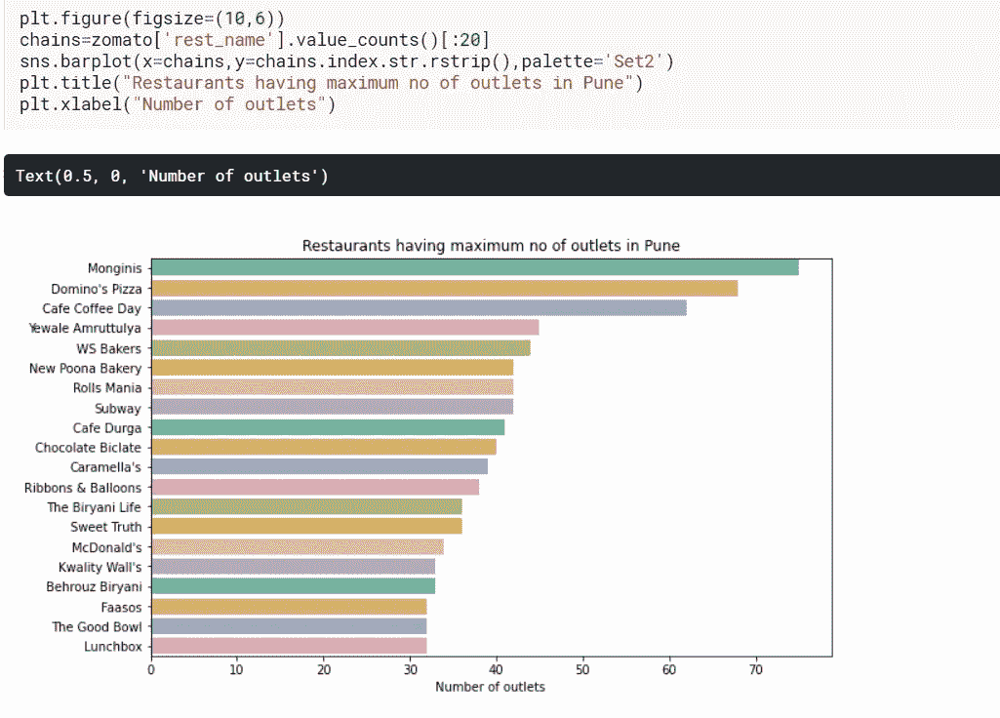

***不是多米诺骨牌或 McD..但是 Monginis 是浦那最大的连锁店！谁能想到呢..***

# 浦那的考加利？

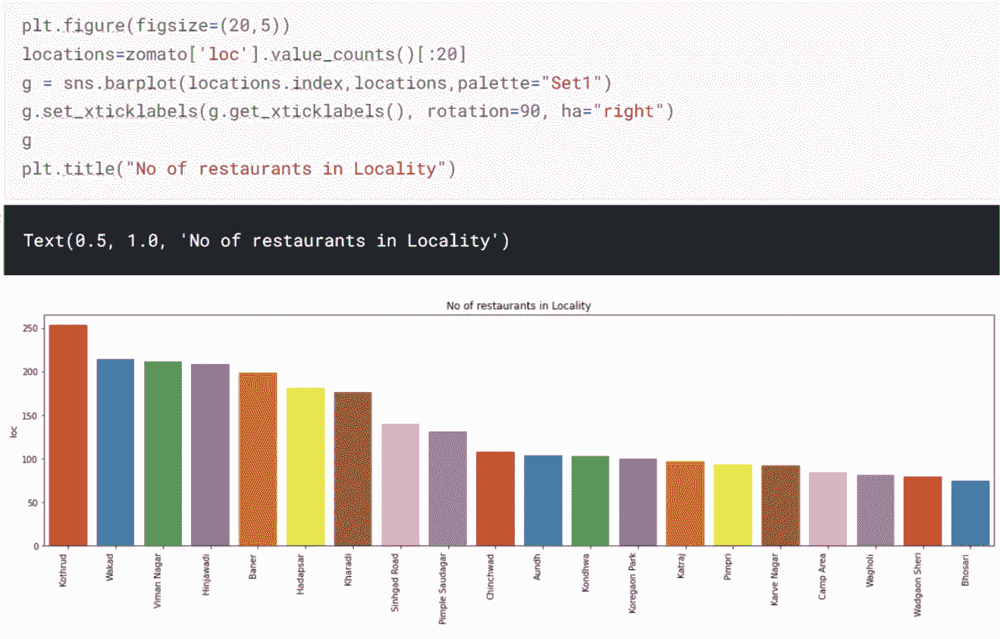

***哇！不是 Koregaon 公园，但是 Kothrud 在浦那有最多的餐馆***

# 比尔亚尼还是披萨？我们最爱什么？

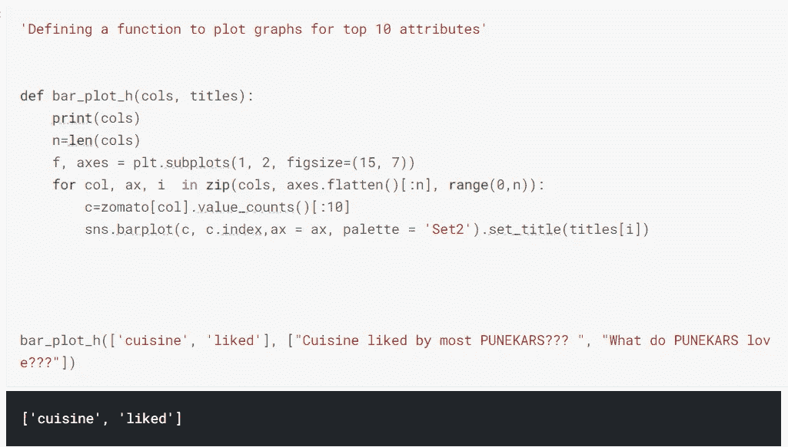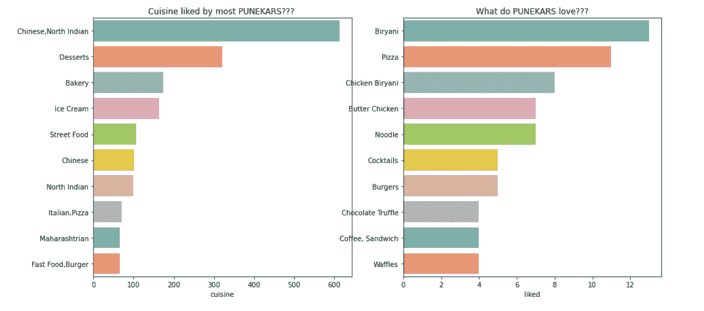

***见..告诉过你..这里乔伊更爱比亚尼…对不起披萨爱好者:(*)**

# 好奇想知道最贵的(不是为胆小的人准备的)和评论最多的餐馆？

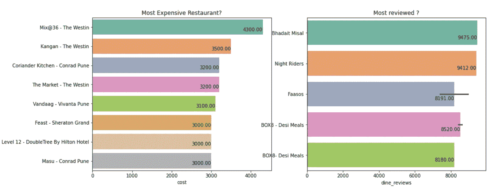

***在最昂贵的 8 家餐厅中，威斯汀有 3 家上榜。***

# 我们真的能相信这些评级吗？

**OMG！！评级为 5.0..但是等等，只有 3 个评论…这就是为什么我有信任问题..咄！！为了得到一个公平的评分概念，我根据对那家餐馆的评论数量计算了一个加权评分。下面是我们如何计算公平评分-
1。查找所有餐馆的评论总数。
2。现在计算评论权重=(评论数/总评论数)
3。加权评分=评分*评论权重
4。在这种情况下，最后一步是将我们的评级标准化，使它们在 0 到 5 的范围内。**

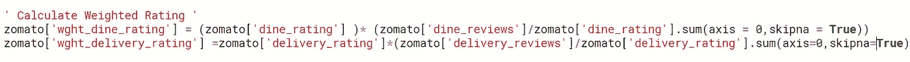

```
#**Normalizing rating to bring them in the case of 0 to 5**
zomato['wght_dine_rating']=5*(zomato['wght_dine_rating']-zomato['wght_dine_rating'].min(axis=0))/(zomato['wght_dine_rating'].max(axis=0) - zomato['wght_dine_rating'].min(axis=0))zomato['wght_delivery_rating']=5*(zomato['wght_delivery_rating']-zomato['wght_delivery_rating'].min(axis=0))/(zomato['wght_delivery_rating'].max(axis=0) - zomato['wght_delivery_rating'].min(axis=0))
```

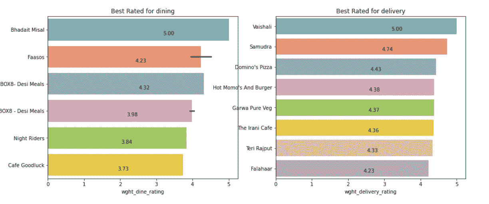

现在你知道去哪里了……虽然这些餐馆大多数都很便宜，因此可能会受到很多人的青睐？请注意，这些评级是加权的，因此与 Zomato 上的评级不同。

# 最贵的 20 家餐馆的位置？

许多位置值也有餐馆名称..因此，根据分隔符将它们分开，并提取分隔符之后的字符串

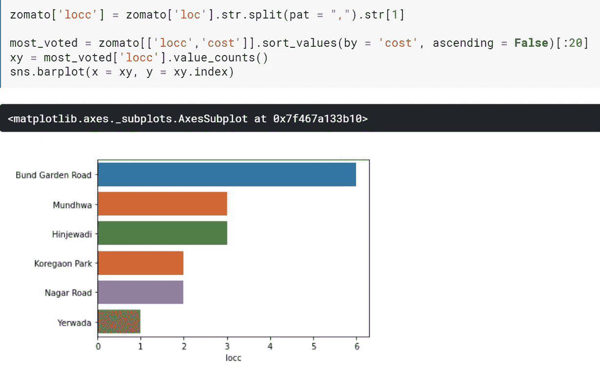

# 考虑物有所值的餐馆？

以下是我们寻找优质预算餐厅的标准-

1.  成本< 1000
2.  Rating (dine or delivery) > 4.3
3.  评论数量(用餐或送货)> 4000

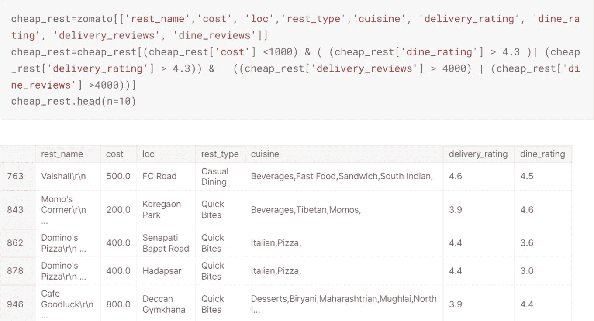

价格合理的餐馆

现在你知道你可以去哪里存点钱了！

# 受到高度评价和高度评论的昂贵餐馆

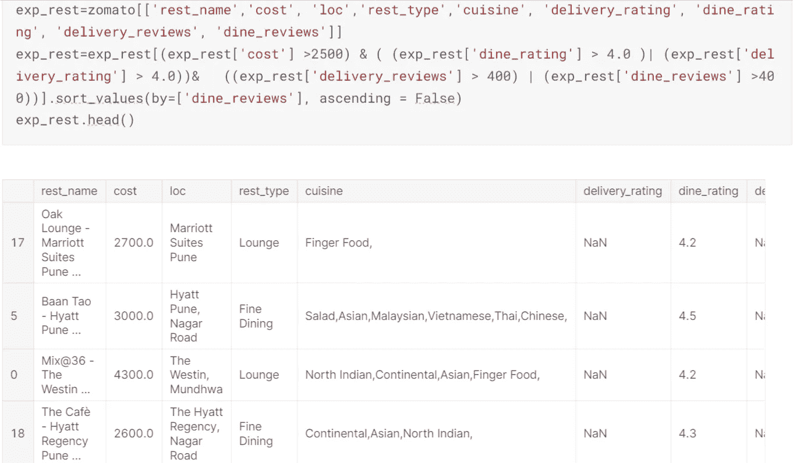

*   ***万豪是高端餐厅中最受欢迎的***
*   ***有趣的是，他们都不提供送货服务。或者人们想出去到这些昂贵的餐厅用餐来营造气氛？***

# 为最受欢迎的菜肴生成单词云

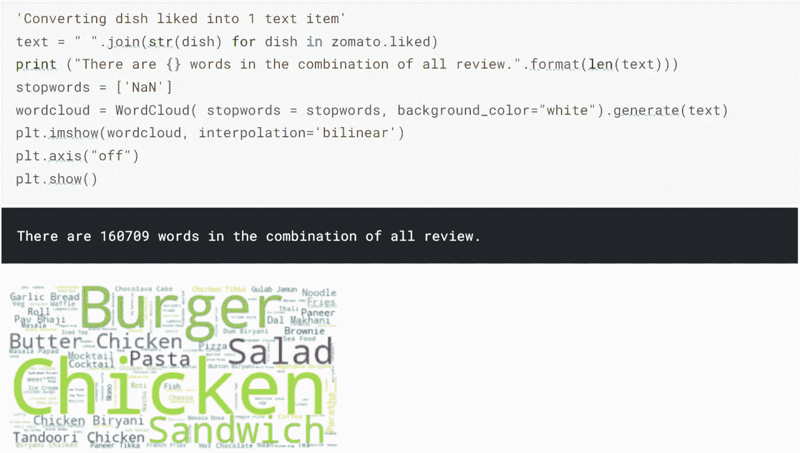

# 咻！！！我们学到了浦那的饮食文化吗？让我们看看—

1.  Monginis 是浦那最大的连锁店。
2.  Kothrud 是餐馆的中心。
3.  乔伊喜欢比亚尼
4.  如果你总是像我一样一文不名…一听到威斯汀这个名字就跑…就跑！！说真的！！
5.  外滩花园路不是普通的路..它拥有许多昂贵的餐馆。
6.  乔伊破产了..但是需要好的食物！！根据评级和评论，浦那的许多人更喜欢便宜的餐馆。
7.  对于金钱的价值，下面是几个选项——
    * vai shali
    * Momo ' s Cafe
    * Dominos
    * Cafe good luck(**我的意思是，有什么不喜欢的？Bun Maska，很好。果酱，很好。茶，好！**)
8.  **中奖了！去鳄龙奥克斯万豪酒店、Baan Tao- Hyatt 酒店、Mix@36- Westin 酒店消费吧……**

**参考文献—**
1。[https://www . ka ggle . com/shah ules/zoma to-complete-EDA-and-lstm-model](https://www.kaggle.com/shahules/zomato-complete-eda-and-lstm-model)
2 .https://www . ka ggle . com/parth Sharma 5795/finding-the-best-restaurants-in-Bangalore